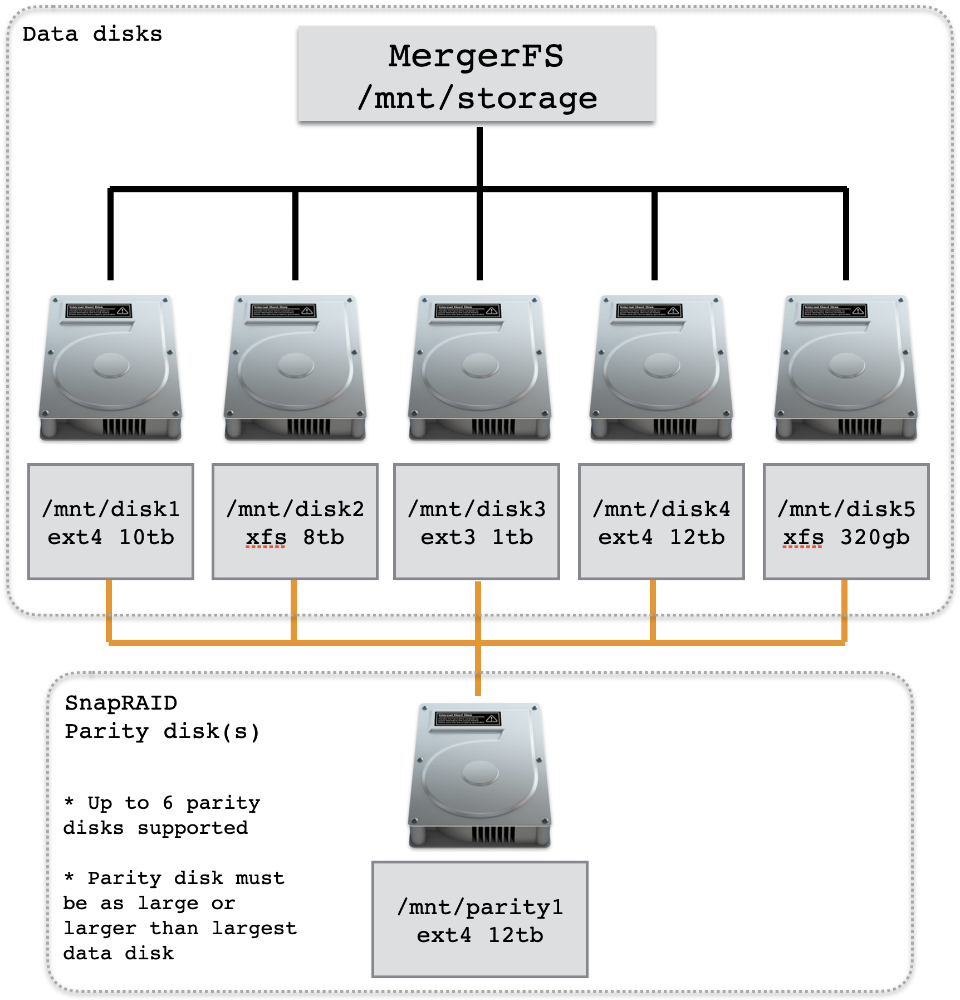

<h1>NAS - Hard metal Builds</h1>

This guide is for dedicated hard metal NAS appliances. The exception is OpenMediaVault (OMV) where our OMV configuration guide also applies to PVE OMV VM installations.

Easy Scripts are available for:

* Synology DiskStations
* Open Media Vault (OMV)

Our Easy Scripts will modify your NAS setting. If you intend to run our Easy Scripts on an existing working NAS which contains any personal or valuable data we highly recommend you first backup the NAS including stored data and configuration settings.

<h2>Features</h2>

Easy Script will fully configure and ready your NAS to support Ahuacate CTs and VMs. The script will create, modify and change system settings including:

* Power User & Group Accounts
    * Groups: medialab:65605, homelab:65606, privatelab:65607, chrootjail:65608
    * Users: media:1605, home:1606, private:1607
    * Users media, home and private required by Ahuacate VM/CT applications
* Chrootjail Group for general User accounts.
* Full set of base and sub-folders ready for all VM/CT applications
* Folder and user permissions including ACLs
* NFS 4.0 exports ready for PVE host backend storage mounts
* SMB 3.0 shares with access permissions set ( by User Group accounts )
* Set Local Domain option to set ( i.e .local, .localdomain, .home.arpa, .lan )


<h2>Prerequisites</h2>

**Network Prerequisites**

- [x] Layer 2/3 Network Switches
- [x] Network Gateway (*recommend xxx.xxx.1.5*)
- [x] Network DHCP server (*recommend xxx.xxx.1.5*)
- [x] Network DNS server (*recommend xxx.xxx.1.5*)
- [x] Network Name Server (*recommend xxx.xxx.1.5*)
- [x] PiHole DNS server (*recommend xxx.xxx.1.6*)
    Configured with Conditional Forwarding addresses:
    * Router DNS server (i.e xxx.xxx.1.5 - UniFi DNS)
    * New LAN-vpngate-world DNS Server (i.e xxx.xxx.30.5 - pfSense VLAN30)
    * New LAN-vpngate-local DNS Server (i.e xxx.xxx.40.5 - pfSense VLAN40)
- [x] Local domain name is set on all network devices (*see note below*)
- [ ] PVE host hostnames are suffixed with a numeric (*i.e pve-01 or pve01 or pve1*)
- [x] NAS appliance hardware has internet access

<h2>Local DNS Records</h2>

We recommend <span style="color:red">you read</span> about network Local DNS and why a PiHole server is a necessity. Click <a href="https://github.com/ahuacate/common/tree/main/pve/src/local_dns_records.md" target="_blank">here</a> to learn more before proceeding any further.

Your network Local Domain or Search domain must be also set. We recommend only top-level domain (spTLD) names for residential and small networks names because they cannot be resolved across the internet. Routers and DNS servers know, in theory, not to forward ARPA requests they do not understand onto the public internet. It is best to choose one of our listed names: local, home.arpa, localdomain or lan only. Do NOT use made-up names.

<h2>Easy Scripts</h2>

To run an Easy Script you must first have an operational NAS machine.

Our Easy Script automates the installation and/or configuration processes. The User when prompted must select the NAS hardware type.

Our Easy Scripts have preset configurations. The installer may accept or decline the ES values. If you decline the User will be prompted to input all required configuration settings. PLEASE read our guide if you are unsure.


<h4><b>1) Synology NAS Easy Script</b></h4>
SSH login to your Synology NAS using your Administrator credentials: `ssh admin@IP_address`. If you have changed your Synology default SSH port use `ssh admin@IP_address:port`. After SSH login you must type `sudo -i` to switch to root user. The Root password is the password used for 'admin'. Then you must run the following commands.

```bash
sudo -i # to change to root user
bash -c "$(wget -qLO - https://raw.githubusercontent.com/ahuacate/nas-hardmetal/main/nas-hardmetal_installer.sh)"
```

<h4><b>2) Open Media Vault (OMV) Easy Script</b></h4>

Your OMV NAS must have a storage filesystem ready and available. Read this guide following step-by-step instructions before running this script.

You must first SSH login to your NAS `ssh root@IP_address` or `ssh root@nas-01.local`. Then you run the following command.
```bash
bash -c "$(wget -qLO - https://raw.githubusercontent.com/ahuacate/nas-hardmetal/main/nas-hardmetal_installer.sh)"
```


If you followed our OMV guide then you created a 'MergerFS & SnapRAID' pool. When the ES prompts you for storage location select the MergerFS pool shown above. 

<hr>

<h4>Table of Contents</h4>
<!-- TOC -->

- [1. OMV configuration](#1-omv-configuration)
    - [1.1. OMV install configuration](#11-omv-install-configuration)
    - [1.2. PCIe Passthrough (VM only)](#12-pcie-passthrough-vm-only)
    - [1.3. Static DHCP reservation](#13-static-dhcp-reservation)
    - [1.4. Prepare your OMV NAS](#14-prepare-your-omv-nas)
    - [1.5. Select a NAS File System](#15-select-a-nas-file-system)
        - [1.5.1. General disk preparation](#151-general-disk-preparation)
        - [1.5.2. Create a File System](#152-create-a-file-system)
        - [1.5.3. Create LUKS Encrypted disks (optional)](#153-create-luks-encrypted-disks-optional)
        - [1.5.4. Configure MergerFS & SnapRaid pool](#154-configure-mergerfs--snapraid-pool)
        - [1.5.5. Configure MergerFS](#155-configure-mergerfs)
        - [1.5.6. Configure SnapRaid](#156-configure-snapraid)
        - [1.5.7. SnapRAID Scheduled Diff and Cron Jobs](#157-snapraid-scheduled-diff-and-cron-jobs)
    - [1.6. Easy Script Configuration](#16-easy-script-configuration)
- [2. Synology configuration](#2-synology-configuration)
- [3. Manual NAS build](#3-manual-nas-build)
    - [3.1. Create Groups](#31-create-groups)
        - [3.1.1. Create Groups](#311-create-groups)
    - [3.2. Change the NAS Home folder permissions (optional)](#32-change-the-nas-home-folder-permissions-optional)
    - [3.3. Modify Users Home Folder](#33-modify-users-home-folder)
    - [3.4. Create Users](#34-create-users)
    - [3.5. NAS Folder Shares](#35-nas-folder-shares)
        - [3.5.1. Folder Permissions](#351-folder-permissions)
        - [3.5.2. Sub Folder Permissions](#352-sub-folder-permissions)
    - [3.6. Create SMB (SAMBA) Shares](#36-create-smb-samba-shares)
    - [3.7. Create PVE NFS Shares](#37-create-pve-nfs-shares)

<!-- /TOC -->

<hr>

# 1. OMV configuration
For OMV hard metal installs follow the online OMV installation [guide](https://www.openmediavault.org/). The installer ISO images archive can be found [here](https://www.openmediavault.org/download.html). [Create a USB stick](https://docs.openmediavault.org/en/latest/installation/index.html) to boot your machine and install OpenMediaVault. 

The PVE hosted OMV installation guide is also available [here](https://github.com/ahuacate/pve-nas).

## 1.1. OMV install configuration
Once the PVE VM or hard metal machine has been powered on with boot OMV media, install OpenMediaVault configuring the steps as shown.


When the System boots successfully you will see the following screen of the OpenMediaVault installer. Select the "Install" option and press enter or wait until the installation starts automatically. 


Select the language for the installation process. 


And your location. The location will be used to define the timezone in one of the next steps and to preselect the keyboard layout. 


Now select the keyboard Layout. In my case, I'll select "German" as layout and press ENTER. 


The installer starts to load some additional packages from the installation media.


Enter the hostname of your NAS server. The hostname is critical because it aids our Ahuacate scripts to identify NAS appliances on your network.


| Recommended Hostname | Description
|---|---
| nas-01 | Primary NAS (your first/main NAS appliance)
| nas-02 | Secondary NAS (your second NAS appliance)
| nas-03 | Third NAS (and so on)


The domain name is requested in the next screen, so the hostname here is the first part of the fully qualified domain name (FQDN). When the server shall have the fqdn "nas-01.local" then the hostname is "server1". 


Enter the domain name of the server. We recommend 'local' because it's your LAN. If you have decided on your local LAN domain name then read on.

We recommend <span style="color:red">you read</span> about network Local DNS and why a PiHole server is a necessity. Click <a href="https://github.com/ahuacate/common/tree/main/pve/src/local_dns_records.md" target="_blank">here</a> to learn more before proceeding any further.

Your network Local Domain or Search domain must be also set. We recommend only top-level domain (spTLD) names for residential and small networks names because they cannot be resolved across the internet. Routers and DNS servers know, in theory, not to forward ARPA requests they do not understand onto the public internet. It is best to choose one of our listed names: local, home.arpa, localdomain or lan only. Do NOT use made-up names.


Enter the root password. This password is used for the shell login, it is not the password of the OpenMediaVault Web interface. Confirm the password by entering it again in the next screen when requested. Record this password.


Select the server time zone and press ENTER. The time zone is important for date/time in log files and for the timestamps of saved files.


If you have configured direct attached physical disk(s) or a PCIe HBA card for pass-through with more than one connected disk you will receive a message about more than one disk being present. It's a warning only so click `Continue`.


If presented with this option select the OMV OS root disk - the disk you want to install OMV OS on. For a PVE VM install it will be labeled as `SCSI3` (0,0,0) (sda) - 10.7 GB QEMU QEMU HARDDISK`. As the prompt says this disk will be erased so select carefully.


The installer starts to copy the system files to Disk now.


Configure the location from where the apt package manager will load the software packages. Choose a location near to you. 


And then select the mirror server. You can just choose the first one if none of the listed mirrors is from your Internet access provider.


If you use an HTTP proxy to access the internet, then enter its details here. Otherwise press `ENTER`. 


Apt will now Download the packages.


Select your bootloader disk. For a PVE VM install it will be labeled as`/dev/sda (scsi-0QEMU_QEMU_HARDDISK_drive-scsi0)` with a 10GB size.


The installation is finished. Press ENTER to reboot the server. Remove USB installation media or set VM  `Hardware` > `CD/DVD Drive (IDE2)` > `Edit`  to `Do not use any media`.

The System is ready. You can now log in to OpenMediaVault on the shell as `root` user or in the Web interface.

> **Web interface**
> URL: http://nas-01.local (hostname.domain)
> User: admin
> Password: openmediavault 
>
>**Client (SSH shell/console)**
> User: root
> Password: The password that you have set during installation.

## 1.2. PCIe Passthrough (VM only)
PCI passthrough allows you to use a physical mainboard PCI SATA or HBA device inside a PVE VM (KVM virtualization only).

If you configure a "PCI passthrough" device, the device is not available to the host anymore.

Navigate using the Promox web interface to VM `vmid (nas-xx)` > `Hardware` > `Add` > `PCI device` and select a PCIe HBA device. The selected device will be passed through to your NAS.

## 1.3. Static DHCP reservation
You must assign a static DHCP reservation at your DHCP server/router for your new OMV NAS. Our standard DHCP and static IP reservations for all NAS appliances are:

| Recommended IP | Description
|---|---
| `192.168.1.10` | nas-01 Primary NAS (your first/main NAS appliance)
| `192.168.1.11` | nas-02 Secondary NAS (your second NAS appliance)
| `192.168.1.12` | nas-03 Third NAS (and so on)

Always reboot your OMV NAS to assign the new IP address.

## 1.4. Prepare your OMV NAS
You need to establish two connections to your OMV host:

>**Web interface**
> URL: http://nas-01.local (hostname.domain or IPv4 address)
> User: admin
> Password: openmediavault
>
>**SSH Client** (SSH, console)
> CLI: ssh root@nas-01.local
> User: root
> Password: The password that you have set during installation.

Perform the following tasks to bring your OMV host up-to-date and ready for configuration. Remember to immediately apply all changes at each stage for the changes to take effect.

1. Cut & Paste the CLI command (all lines) into your OMV SSH shell. This command will install OMV-Extras.

```
wget -O - https://github.com/OpenMediaVault-Plugin-Developers/packages/raw/main/install | bash
```
2. Navigate to `System` > `Update Management`:
-- Settings: `Community-maintained updates`
-- Updates: `Install updates`
3. Cut & Paste the CLI command (all lines) into your OMV SSH shell. This command will install MergerFS and SnapRAID.

```
apt-get install openmediavault-mergerfs -y && \
apt-get install openmediavault-snapraid -y
```

## 1.5. Select a NAS File System
OMV has many options - RAID, LVM, MergerFS, ZFS, SnapRaid and more. We recommend the following:

* BTRFS/Ext4 &rarr; MergerFS &rarr; SnapRaid (Recommended - requires minimum 3 disks)

### 1.5.1. General disk preparation
Let's prepare your new storage disks. When required to select a disk always select the lowest disk device ID first. Comment or label data drives in order as data1, data2 etc., and if you've chosen the MergerFS/SnapRAID system then label the parity drives as parity1, parity2 etc. The parity drive must be your largest capacity disk(s).

> Warning: Wipe will delete all existing data on the drives! Make sure to have at least one backup, if they contain data that you want to keep.

1. Navigate to `Storage` > `Disks` (for all, but not OS SSD): `Wipe`
2. Navigate to `Storage` > `Disks` > `Edit` (for all, but OS SSD): Power 1, Maximum performance, Spindown 30min, Enable write-cache
3. Navigate to `Storage` > `Disks` > `Smart` > `Settings`: Enable (disable for VM)
4. Navigate to `Storage` > `Disks` > `Smart` > `Devices`: Activate for each drive (disable for VM)

### 1.5.2. Create a File System
At this stage, you must choose a file system. Ext4 is more mature, whereas BTRFS has features that should allow for greater resilience (and, in theory, should make it less susceptible to data corruption). Both file systems can recover from a power loss, but using BTRFS will not immunize you from them. I use BTRFS for multiple disk systems.

1. Navigate to `Storage` > `File systems` > `+ Add` > `+ Create` (for all, but OS SSD):
-- `Device` Select a disk
-- `Type` BTRFS
You will be prompted to mount the disk. Comment or label the drives as data1, data2 etc., and parity drives as parity1, parity2 etc.
-- File System `/dev/sdx [BTRFS, 55.89 GiB]` (example)
-- Usage Threshold `95%`
-- Comment `data[1-9]` or `parity[1-9]`

### 1.5.3. Create LUKS Encrypted disks (optional)
I do not use LUKS. For those who know what they are doing.

> Warning: All data on the disks will be deleted. If you’ve followed this guide to the dot, no data was added after the previous `Wipe` anyway.

Repeat the following steps for all data and parity drives.

1. Navigate to `Storage` > `Encryption` > `+ Add`:
-- Device: `Select a data/parity disk`
-- Cipher: `Default`
-- Label: Data drives as `data1`, `data2` etc., and parity drives as `parity1`, `parity2` etc
-- Passphrase: Create
-- Passphrase: Create

### 1.5.4. Configure MergerFS & SnapRaid pool
MergerFS allows you to combine drives of different sizes and speeds into a single mount point, automatically managing how files are stored in the background.

SnapRAID provides us with some basic protection against drive failures and is the perfect pairing with MergerFS. SnapRaid essentially takes JBOD and provides a cohesive glue for them protecting against drive failure and bit-rot. It is primarily targeted at media center users with lots of big files that rarely change.

Read more about MergerFS & SnapRAID [here](https://perfectmediaserver.com/tech-stack/mergerfs/).

### 1.5.5. Configure MergerFS

1. Create a pool of your new disks. Navigate to `Storage` > `mergerfs` > `+ Add` icon:
-- Name: `pool1`
-- File Systems: `/dev/sdx [data1]` (select data disks only)
-- Policy: `Existing path - most free space`
-- Minimum free space: 5% of smallest drive size (e.g. 4TB drive = 200G) (feel free to adjust)

### 1.5.6. Configure SnapRaid



SnapRaid supports mismatched disk sizes although the <span style="color:red">parity drive must be</span> large or larger than the largest data disk (see diagram above).

You must add all your new storage disks individually leaving the <span style="color:red">largest disk(s) for parity</span>.

1. Navigate to `Services` > `SnapRAID` > `Drives` > `+ Add`: (data)
-- Drive: `/dev/sdx [data1]` (select a data disk)
-- Name: `data1` (same as input disk name)
-- Check: Content, Data
2. Repeat for all data disks.
3. Navigate to `Services` > `SnapRAID` > `Drives` > `+ Add`: (parity)
-- Drive: `/dev/sdx [parity1]` (select a data disk)
-- Name: `parity1` (same as input disk name)
-- Check: Content, Parity
4. Repeat for all parity disks.


Your SnapRAID drive layout should resemble the above diagram (i.e data1, data2, data3 + parity1).

### 1.5.7. SnapRAID Scheduled Diff and Cron Jobs
SnapRAID plugin will generate a cron job in the `System` > `Scheduled Tasks` tab. This task only contains diff operation which calculates file differences from the last snap. To maintain the parity synchronized, sync and scrub jobs are also needed.

1. Navigate to `Services` > `SnapRAID` > `Settings` > `Scheduled diff`: Enable & Save
2. Navigate to `System` > `Scheduled Tasks` > `+ Add`:
-- Enable: `☑`
-- Time of execution: `Hourly`
-- User: `root`
-- Command: `/usr/sbin/omv-snapraid --force-zero sync`

Your OMV NAS is now ready to configure with our custom Easy Script.

## 1.6. Easy Script Configuration
We have Easy Scripts for configuring Synology and OpenMediaVault only.

>Warning: Our Easy Scripts are fully automated and configure your NAS ready for integration into our Proxmox environment. Ideally, Easy Script should be run on a new fresh NAS installation. If not, fully backup all private data before running our Easy Script.

The links to our Easy Scripts are at the beginning of this guide.

<hr>

# 2. Synology configuration
Fully update your Synology DiskStation before running our Easy Script. Synology runs a custom flavor of Debian with proprietary commands. The Easy Script was written for Synology v7. One peculiar issue is NFS. While the NFS mounts are created they will not appear in the Synology WebGUI for some odd reason.

The links to our Easy Scripts are at the beginning of this guide.

<hr>

# 3. Manual NAS build
For those Users who wish to perform the tasks manually or understand what our Easy Script does read on.

It's assumed the installer has some Linux skills. There are lots of online guides about how to configure NAS brands and Linux networking.

- **NFS**
Your NAS NFS server must support NFSv3/v4.
- **SMB/CIFS**
Your NAS SMB/CIFS server must support SMB3 protocol (PVE default). SMB1 is NOT supported.
- **ACL**
Access control list (ACL) provides an additional, more flexible permission mechanism for your PVE storage pools. Enable ACL.
- **CHATTR**
Understand Linux chattr for base and sub folder protection.

## 3.1. Create Groups
All our PVE CT applications require a specific set of UID and GUID to work properly. So make sure your UIDs and GUIDs exactly match our guide.

| Defaults                | Description             | Notes                                                                                                                |
|-------------------------|-------------------------|----------------------------------------------------------------------------------------------------------------------|
| **Default User Groups** |                         |                                                                                                                      |
|                         | medialab - GUID 65605   | For media Apps (Sonarr, Radar, Jellyfin etc)                                                                         |
|                         | homelab - GUID 65606    | For everything to do with your Smart Home (CCTV, Home Assistant)                                                     |
|                         | privatelab - GUID 65607 | Power, trusted, admin Users                                                                                          |
|                         | chrootjail - GUID 65608 | Users are restricted or jailed within their own home folder. But they they have read only access to medialab folders |
|                         | sftp-access - GUID 65609 | sFTP access group (for sftp OMV plugin only) |
| **Default Users**       |                         |                                                                                                                      |
|                         | media - UID 1605        | Member of group medialab                                                                                             |
|                         | home - UID 1606         | Member of group homelab. Supplementary member of group medialab                                                      |
|                         | private - UID 1607      | Member of group privatelab. Supplementary member of group medialab, homelab                                         |


### 3.1.1. Create Groups
Create the following Groups.

| Group Name | GUID  |
|------------|-------|
| medialab   | 65605 |
| homelab    | 65606 |
| privatelab | 65607 |
| chrootjail | 65608 |
| sftp-access (OMV only) | 65609 |

## 3.2. Change the NAS Home folder permissions (optional)
Proceed with caution. If you are NOT sure skip this step.

Linux `/etc/adduser.conf` has a `DIR_MODE` setting which sets a Users HOME directory when its first created. The default mode likely 0755.

For added security we change this to 0750 where:
> 0755 = User:`rwx` Group:`r-x` World:`r-x`
0750 = User:`rwx` Group:`r-x` World:`---` (i.e. World: no access)

Depending on your NAS you may be able to change this setting 
```
sed -i "s/DIR_MODE=.*/DIR_MODE=0750/g" /etc/adduser.conf
```

Running the above command will change all-new User HOME folder permissions to `0750` globally on your NAS.

## 3.3. Modify Users Home Folder
Set `/base_folder/homes` permissions for Users media. home and private.

| Owner | Permissions |
|-------|-------------|
| root  | 0750        |


Here is the Linux CLI for the task:
```
# Set VAR
BASE_FOLDER="insert full path (i.e /dir1/dir2/homes, /srv/UUID/homes)"

sudo mkdir -p ${BASE_FOLDER}/homes
sudo chgrp -R root ${BASE_FOLDER}/homes
sudo chmod -R 0750 ${BASE_FOLDER}/homes
```

## 3.4. Create Users
Create our list of PVE users. These are required by various PVE CT applications. Without them, nothing will work.

| Username  | UID | Home Folder | Group Member
|---|---|---|---|---|
|  media |  1605 | /BASE_FOLDER/homes/media | medialab
|  home |  1606 | /BASE_FOLDER/homes/home | homelab
|  private |  1607 | /BASE_FOLDER/homes/private | privatelab

Here is the Linux CLI for the task:
```
# Set VAR
BASE_FOLDER="insert full path (i.e /dir1/dir2)"

# Create User media
useradd -m -d ${BASE_FOLDER}/homes/media -u 1605 -g medialab -s /bin/bash media
# Create User home
useradd -m -d ${BASE_FOLDER}/homes/home -u 1606 -g homelab -G medialab -s /bin/bash home
# Create User private
useradd -m -d ${BASE_FOLDER}/homes/private -u 1607 -g privatelab -G medialab,homelab -s /bin/bash private
```

## 3.5. NAS Folder Shares
You need to create a set of folder shares in a 'storage volume' on your NAS. The new folder shares are mounted by your PVE hosts as NFS or SMB/CIFS mount points for creating your PVE host backend storage ( pve-01 ).

We refer to the NAS 'storage volume' as your NAS 'base folder'.

> For example, on a Synology the default volume is `/volume1`. So on a Synology our "base folder" would be: `/volume1`.

Your NAS may already have some of the required folder structure. If so, then create the sub-directory where applicable.

Create the following folders on your NAS.
```
# 65605=medialab
# 65606=homelab
# 65607=privatelab
# 65608=chrootjail
# FOLDERNAME GROUP PERMISSIONS ACL

Your NAS (nas-01)
│
└──  base volume1/
    ├── audio - root 0750 65605:rwx 65607:rwx 65608:r-x
    ├── backup - root 1750 65605:rwx 65606:rwx 65607:rwx
    ├── books - root 0755 65605:rwx 65607:rwx 65608:r-x
    ├── cloudstorage - root 1750 65606:rwx 65607:rwx
    ├── docker - root 0750 65605:rwx 65606:rwx 65607:rwx
    ├── downloads - root 0755 65605:rwx 65607:rwx
    ├── git - root 0750 65607:rwx
    ├── homes - root 0777
    ├── music - root 0755 65605:rwx 65607:rwx 65608:r-x
    ├── openvpn - root 0750 65607:rwx
    ├── photo - root 0750 65605:rwx 65607:rwx 65608:r-x
    ├── proxmox - root 0750 65607:rwx 65606:rwx
    ├── public - root 1777 65605:rwx 65606:rwx 65607:rwx 65608:rwx
    ├── sshkey - root 1750 65607:rwx
    ├── video - root 0750 65605:rwx 65607:rwx 65608:r-x
    └── transcode - root 0750 65605:rwx 65607:rwx
```

### 3.5.1. Folder Permissions
Create sub-folders with permissions as shown [here.](https://raw.githubusercontent.com/ahuacate/common/main/nas/src/nas_basefolderlist)

A CLI example for the task audio:
```
# Set VAR
BASE_FOLDER="insert full path (i.e /dir1/dir2)"

sudo chgrp -R root ${BASE_FOLDER}/audio
sudo chmod -R 750 ${BASE_FOLDER}/audio
sudo setfacl -Rm g:medialab:rwx,g:privatelab:rwx,g:chrootjail:r-x  ${BASE_FOLDER}/audio
```

### 3.5.2. Sub Folder Permissions
Create sub-folders with permissions as shown [here.](https://raw.githubusercontent.com/ahuacate/common/main/nas/src/nas_basefoldersubfolderlist)

```
/srv/nas-01
├── audio
│   ├── audiobooks
│   └── podcasts
├── backup
├── books
│   ├── comics
│   ├── ebooks
│   └── magazines
├── cloudstorage
├── docker
├── downloads
├── git
├── homes
│   ├── chrootjail
│   └── home
├── music
├── openvpn
├── photo
├── proxmox
│   └── backup
├── public
│   └── autoadd
│       ├── direct_import
│       │   └── lazylibrarian
│       ├── torrent
│       │   ├── documentary
│       │   ├── flexget-movies
│       │   ├── flexget-series
│       │   ├── lazy
│       │   ├── movies
│       │   ├── music
│       │   ├── pron
│       │   ├── series
│       │   └── unsorted
│       ├── usenet
│       │   ├── documentary
│       │   ├── flexget-movies
│       │   ├── flexget-series
│       │   ├── lazy
│       │   ├── movies
│       │   ├── music
│       │   ├── pron
│       │   ├── series
│       │   └── unsorted
│       └── vidcoderr
│           ├── in_homevideo
│           ├── in_stream
│           │   ├── documentary
│           │   ├── movies
│           │   ├── musicvideo
│           │   ├── pron
│           │   └── series
│           ├── in_unsorted
│           └── out_unsorted
├── sshkey
│── video
│   ├── cctv
│   ├── documentary
│   ├── homevideo
│   ├── movies
│   ├── musicvideo
│   ├── pron
│   ├── series
│   ├── stream
│   └── documentary
│       ├── movies
│       ├── musicvideo
│       ├── pron
│       └── series
└── transcode
    ├── jellyfin
    └── vidcoderr
```

## 3.6. Create SMB (SAMBA) Shares
Your `/etc/samba/smb.conf` file should include the following PVE shares. This is an example from a Ubuntu NAS.

Remember to replace `BASE_FOLDER` with your full path (i.e /dir1/dir2). Also, you must restart your NFS service to invoke the changes.

The sample file is from a Ubuntu 21.04 server.

```
[global]
workgroup = WORKGROUP
server string = nas-05
server role = standalone server
disable netbios = yes
dns proxy = no
interfaces = 127.0.0.0/8 eth0
bind interfaces only = yes
log file = /var/log/samba/log.%m
max log size = 1000
syslog = 0
panic action = /usr/share/samba/panic-action %d
passdb backend = tdbsam
obey pam restrictions = yes
unix password sync = yes
passwd program = /usr/bin/passwd %u
passwd chat = *Enter\snew\s*\spassword:* %n\n *Retype\snew\s*\spassword:* %n\n *password\supdated\ssuccessfully* .
pam password change = yes
map to guest = bad user
usershare allow guests = yes
inherit permissions = yes
inherit acls = yes
vfs objects = acl_xattr
follow symlinks = yes
hosts allow = 127.0.0.1 192.168.1.0/24 192.168.20.0/24 192.168.30.0/24 192.168.40.0/24 192.168.50.0/24 192.168.60.0/24 192.168.80.0/24
hosts deny = 0.0.0.0/0

[homes]
comment = home directories
browseable = yes
read only = no
create mask = 0775
directory mask = 0775
hide dot files = yes
valid users = %S

[public]
comment = public anonymous access
path = /srv/nas-01/public
writable = yes
browsable =yes
public = yes
read only = no
create mode = 0777
directory mode = 0777
force user = nobody
guest ok = yes
hide dot files = yes

[audio]
  comment = audio folder access
  path = /srv/nas-01/audio
  browsable = yes
  read only = no
  create mask = 0775
  directory mask = 0775
  valid users = %S, @root, @medialab, @privatelab


[backup]
  comment = backup folder access
  path = /srv/nas-01/backup
  browsable = yes
  read only = no
  create mask = 0775
  directory mask = 0775
  valid users = %S, @root, @medialab, @homelab, @privatelab


[books]
  comment = books folder access
  path = /srv/nas-01/books
  browsable = yes
  read only = no
  create mask = 0775
  directory mask = 0775
  valid users = %S, @root, @medialab, @privatelab


[cloudstorage]
  comment = cloudstorage folder access
  path = /srv/nas-01/cloudstorage
  browsable = yes
  read only = no
  create mask = 0775
  directory mask = 0775
  valid users = %S, @root, @homelab, @privatelab


[docker]
  comment = docker folder access
  path = /srv/nas-01/docker
  browsable = yes
  read only = no
  create mask = 0775
  directory mask = 0775
  valid users = %S, @root, @medialab, @homelab, @privatelab


[downloads]
  comment = downloads folder access
  path = /srv/nas-01/downloads
  browsable = yes
  read only = no
  create mask = 0775
  directory mask = 0775
  valid users = %S, @root, @medialab, @privatelab


[git]
  comment = git folder access
  path = /srv/nas-01/git
  browsable = yes
  read only = no
  create mask = 0775
  directory mask = 0775
  valid users = %S, @root, @privatelab


[music]
  comment = music folder access
  path = /srv/nas-01/music
  browsable = yes
  read only = no
  create mask = 0775
  directory mask = 0775
  valid users = %S, @root, @medialab, @privatelab


[openvpn]
  comment = openvpn folder access
  path = /srv/nas-01/openvpn
  browsable = yes
  read only = no
  create mask = 0775
  directory mask = 0775
  valid users = %S, @root, @privatelab


[photo]
  comment = photo folder access
  path = /srv/nas-01/photo
  browsable = yes
  read only = no
  create mask = 0775
  directory mask = 0775
  valid users = %S, @root, @medialab, @privatelab


[proxmox]
  comment = proxmox folder access
  path = /srv/nas-01/proxmox
  browsable = yes
  read only = no
  create mask = 0775
  directory mask = 0775
  valid users = %S, @root, @privatelab, @homelab


[sshkey]
  comment = sshkey folder access
  path = /srv/nas-01/sshkey
  browsable = yes
  read only = no
  create mask = 0775
  directory mask = 0775
  valid users = %S, @root, @privatelab


[video]
  comment = video folder access
  path = /srv/nas-01/video
  browsable = yes
  read only = no
  create mask = 0775
  directory mask = 0775
  valid users = %S @root, @medialab, @privatelab
```

## 3.7. Create PVE NFS Shares
Modify your NFS exports file `/etc/exports` to include the following.

Remember to replace `BASE_FOLDER` with your full path (i.e /dir1/dir2). Also, note each NFS export is defined a PVE hostname or IPv4 address for all primary and secondary (cluster nodes) machines. Modify if your PVE host is different.

The sample file is from a Ubuntu 22.04 server. In these example we use hostname exports 'pve-01 to 04'.

```
# /etc/exports: the access control list for filesystems which may be exported
#               to NFS clients.  See exports(5).
#
# Example for NFSv2 and NFSv3:
# /srv/homes       hostname1(rw,sync,no_subtree_check) hostname2(ro,sync,no_subtree_check)
#
# Example for NFSv4:
# /srv/nfs4        gss/krb5i(rw,sync,fsid=0,crossmnt,no_subtree_check)
# /srv/nfs4/homes  gss/krb5i(rw,sync,no_subtree_check)
#

# backup export
/srv/nas-01/backup pve-01(rw,async,no_wdelay,no_root_squash,insecure_locks,sec=sys,anonuid=1025,anongid=100) pve-02(rw,async,no_wdelay,no_root_squash,insecure_locks,sec=sys,anonuid=1025,anongid=100) pve-03(rw,async,no_wdelay,no_root_squash,insecure_locks,sec=sys,anonuid=1025,anongid=100) pve-04(rw,async,no_wdelay,no_root_squash,insecure_locks,sec=sys,anonuid=1025,anongid=100)

# cloudstorage export
/srv/nas-01/cloudstorage pve-01(rw,async,no_wdelay,no_root_squash,insecure_locks,sec=sys,anonuid=1025,anongid=100) pve-02(rw,async,no_wdelay,no_root_squash,insecure_locks,sec=sys,anonuid=1025,anongid=100) pve-03(rw,async,no_wdelay,no_root_squash,insecure_locks,sec=sys,anonuid=1025,anongid=100) pve-04(rw,async,no_wdelay,no_root_squash,insecure_locks,sec=sys,anonuid=1025,anongid=100)

# docker export
/srv/nas-01/docker pve-01(rw,async,no_wdelay,no_root_squash,insecure_locks,sec=sys,anonuid=1025,anongid=100) pve-02(rw,async,no_wdelay,no_root_squash,insecure_locks,sec=sys,anonuid=1025,anongid=100) pve-03(rw,async,no_wdelay,no_root_squash,insecure_locks,sec=sys,anonuid=1025,anongid=100) pve-04(rw,async,no_wdelay,no_root_squash,insecure_locks,sec=sys,anonuid=1025,anongid=100)

# downloads export
/srv/nas-01/downloads pve-01(rw,async,no_wdelay,no_root_squash,insecure_locks,sec=sys,anonuid=1025,anongid=100) pve-02(rw,async,no_wdelay,no_root_squash,insecure_locks,sec=sys,anonuid=1025,anongid=100) pve-03(rw,async,no_wdelay,no_root_squash,insecure_locks,sec=sys,anonuid=1025,anongid=100) pve-04(rw,async,no_wdelay,no_root_squash,insecure_locks,sec=sys,anonuid=1025,anongid=100)

# proxmox export
/srv/nas-01/proxmox pve-01(rw,async,no_wdelay,no_root_squash,insecure_locks,sec=sys,anonuid=1025,anongid=100) pve-02(rw,async,no_wdelay,no_root_squash,insecure_locks,sec=sys,anonuid=1025,anongid=100) pve-03(rw,async,no_wdelay,no_root_squash,insecure_locks,sec=sys,anonuid=1025,anongid=100) pve-04(rw,async,no_wdelay,no_root_squash,insecure_locks,sec=sys,anonuid=1025,anongid=100)

# public export
/srv/nas-01/public pve-01(rw,async,no_wdelay,no_root_squash,insecure_locks,sec=sys,anonuid=1025,anongid=100) pve-02(rw,async,no_wdelay,no_root_squash,insecure_locks,sec=sys,anonuid=1025,anongid=100) pve-03(rw,async,no_wdelay,no_root_squash,insecure_locks,sec=sys,anonuid=1025,anongid=100) pve-04(rw,async,no_wdelay,no_root_squash,insecure_locks,sec=sys,anonuid=1025,anongid=100)

# audio export
/srv/nas-01/audio pve-01(rw,async,no_wdelay,no_root_squash,insecure_locks,sec=sys,anonuid=1025,anongid=100) pve-02(rw,async,no_wdelay,no_root_squash,insecure_locks,sec=sys,anonuid=1025,anongid=100) pve-03(rw,async,no_wdelay,no_root_squash,insecure_locks,sec=sys,anonuid=1025,anongid=100) pve-04(rw,async,no_wdelay,no_root_squash,insecure_locks,sec=sys,anonuid=1025,anongid=100) 192.168.50.0/24(rw,async,no_wdelay,crossmnt,insecure,all_squash,insecure_locks,sec=sys,anonuid=1024,anongid=100)

# books export
/srv/nas-01/books pve-01(rw,async,no_wdelay,no_root_squash,insecure_locks,sec=sys,anonuid=1025,anongid=100) pve-02(rw,async,no_wdelay,no_root_squash,insecure_locks,sec=sys,anonuid=1025,anongid=100) pve-03(rw,async,no_wdelay,no_root_squash,insecure_locks,sec=sys,anonuid=1025,anongid=100) pve-04(rw,async,no_wdelay,no_root_squash,insecure_locks,sec=sys,anonuid=1025,anongid=100) 192.168.50.0/24(rw,async,no_wdelay,crossmnt,insecure,all_squash,insecure_locks,sec=sys,anonuid=1024,anongid=100)

# music export
/srv/nas-01/music pve-01(rw,async,no_wdelay,no_root_squash,insecure_locks,sec=sys,anonuid=1025,anongid=100) pve-02(rw,async,no_wdelay,no_root_squash,insecure_locks,sec=sys,anonuid=1025,anongid=100) pve-03(rw,async,no_wdelay,no_root_squash,insecure_locks,sec=sys,anonuid=1025,anongid=100) pve-04(rw,async,no_wdelay,no_root_squash,insecure_locks,sec=sys,anonuid=1025,anongid=100) 192.168.50.0/24(rw,async,no_wdelay,crossmnt,insecure,all_squash,insecure_locks,sec=sys,anonuid=1024,anongid=100)

# photo export
/srv/nas-01/photo pve-01(rw,async,no_wdelay,no_root_squash,insecure_locks,sec=sys,anonuid=1025,anongid=100) pve-02(rw,async,no_wdelay,no_root_squash,insecure_locks,sec=sys,anonuid=1025,anongid=100) pve-03(rw,async,no_wdelay,no_root_squash,insecure_locks,sec=sys,anonuid=1025,anongid=100) pve-04(rw,async,no_wdelay,no_root_squash,insecure_locks,sec=sys,anonuid=1025,anongid=100) 192.168.50.0/24(rw,async,no_wdelay,crossmnt,insecure,all_squash,insecure_locks,sec=sys,anonuid=1024,anongid=100)

# video export
/srv/nas-01/video pve-01(rw,async,no_wdelay,no_root_squash,insecure_locks,sec=sys,anonuid=1025,anongid=100) pve-02(rw,async,no_wdelay,no_root_squash,insecure_locks,sec=sys,anonuid=1025,anongid=100) pve-03(rw,async,no_wdelay,no_root_squash,insecure_locks,sec=sys,anonuid=1025,anongid=100) pve-04(rw,async,no_wdelay,no_root_squash,insecure_locks,sec=sys,anonuid=1025,anongid=100) 192.168.50.0/24(rw,async,no_wdelay,crossmnt,insecure,all_squash,insecure_locks,sec=sys,anonuid=1024,anongid=100)

# transcode export
/srv/nas-01/transcode pve-01(rw,async,no_wdelay,no_root_squash,insecure_locks,sec=sys,anonuid=1025,anongid=100) pve-02(rw,async,no_wdelay,no_root_squash,insecure_locks,sec=sys,anonuid=1025,anongid=100) pve-03(rw,async,no_wdelay,no_root_squash,insecure_locks,sec=sys,anonuid=1025,anongid=100) pve-04(rw,async,no_wdelay,no_root_squash,insecure_locks,sec=sys,anonuid=1025,anongid=100) 192.168.50.0/24(rw,async,no_wdelay,crossmnt,insecure,all_squash,insecure_locks,sec=sys,anonuid=1024,anongid=100)
```