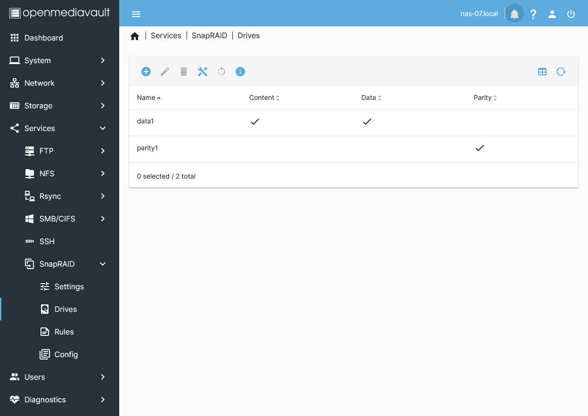

<h1>NAS - Hard metal Builds</h1>

This guide is for hard metal and heavyweight NAS appliances including our Proxmox OMV VM installations.

Easy Scripts are available for:

* Synology DiskStations
* Open Media Vault (OMV)

Please note that our Easy Scripts will alter your NAS settings. Therefore, if you plan on using our Easy Scripts on an already operational NAS that contains important or personal data, we suggest you backup the NAS, including stored data and configuration settings, beforehand.

<h2>Features</h2>

Our Easy Script will create, modify and change system settings including:

* Power User & Group Accounts
    * Groups: medialab:65605, homelab:65606, privatelab:65607, chrootjail:65608
    * Users: media:1605, home:1606, private:1607
    * Users media, home and private required by Ahuacate VM/CT applications
* Chrootjail Group for general User accounts.
* Full set of base and sub-folders ready for all VM/CT applications
* Folder and user permissions including ACLs
* NFS 4.0 exports ready for PVE host backend storage mounts
* SMB 3.0 shares with access permissions set ( by User Group accounts )
* Set Local Domain option to set ( i.e .local, .localdomain, .home.arpa, .lan )


<h2>Prerequisites</h2>

Read about our <a href="https://github.com/ahuacate/common/tree/main/pve/src/local_about_our_build.md" target="_blank">system-wide requirements</a> before proceeding any further.

**Network Prerequisites**

- [x] Layer 2/3 Network Switches
- [x] Network Gateway (*recommend xxx.xxx.1.5*)
- [x] Network DHCP server (*recommend xxx.xxx.1.5*)
- [x] Network DNS server (*recommend xxx.xxx.1.5*)
- [x] Network Name Server (*recommend xxx.xxx.1.5*)
- [x] PiHole DNS server (*recommend xxx.xxx.1.6*)
    Configured with Conditional Forwarding addresses:
    * Router DNS server (i.e xxx.xxx.1.5 - UniFi DNS)
    * New LAN-vpngate-world DNS Server (i.e xxx.xxx.30.5 - pfSense VLAN30)
    * New LAN-vpngate-local DNS Server (i.e xxx.xxx.40.5 - pfSense VLAN40)
- [x] Local domain name is set on all network devices (*see note below*)
- [ ] PVE host hostnames are suffixed with a numeric (*i.e pve-01 or pve01 or pve1*)
- [x] NAS appliance hardware has internet access

<h2>Local DNS Records</h2>

Before proceeding, we <span style="color:red">strongly advise</span> that you familiarize yourself with network Local DNS and the importance of having a PiHole server. To learn more, click <a href="https://github.com/ahuacate/common/tree/main/pve/src/local_dns_records.md" target="_blank">here</a>.

It is essential to set your network's Local Domain or Search domain. For residential and small networks, we recommend using only top-level domain (spTLD) names because they cannot be resolved across the internet. Routers and DNS servers understand that ARPA requests they do not recognize should not be forwarded onto the public internet. It is best to select one of the following names: local, home.arpa, localdomain, or lan only. We strongly advise against using made-up names.

<h2>Easy Scripts</h2>

You must have an operational NAS machine.

Easy Scripts simplify the process of installing and configuring preset configurations. To use them, all you have to do is copy and paste the Easy Script command into your terminal window, hit Enter, and follow the prompts and terminal instructions.

Please note that all Easy Scripts assume that your network is VLAN and DHCP IPv4 ready. If this is not the case, you can decline the Easy Script prompt to accept our default settings. Simply enter 'n' to proceed without the default settings. After declining the default settings, you can configure all your PVE container variables.

However, before proceeding, we highly recommend that you read our guide to fully understand the input requirements.

<h4><b>1) Synology NAS Easy Script</b></h4>
SSH login to your Synology NAS using your Administrator credentials: `ssh admin@IP_address`. If you have changed your Synology default SSH port use `ssh admin@IP_address:port`. After SSH login you must type `sudo -i` to switch to root user. The Root password is the password used for 'admin'. Then you must run the following commands.

```bash
sudo -i # to change to root user
bash -c "$(wget -qLO - https://raw.githubusercontent.com/ahuacate/nas-hardmetal/main/nas-hardmetal_installer.sh)"
```

<h4><b>2) Open Media Vault (OMV) Easy Script</b></h4>

Your OMV NAS must have a storage filesystem ready and available before proceeding with this Easy Script. Read the guide below following step-by-step instructions before running this script.

You must first SSH login to your NAS `ssh root@IP_address` or `ssh root@nas-01.local`. Then you run the following command.
```bash
bash -c "$(wget -qLO - https://raw.githubusercontent.com/ahuacate/nas-hardmetal/main/nas-hardmetal_installer.sh)"
```


If you followed our OMV guide then you created a 'MergerFS & SnapRAID' pool. When the Easy Script prompts you for a storage location select the MergerFS pool shown above in the terminal. 

<hr>

<h4>Table of Contents</h4>
<!-- TOC -->

- [1. OMV configuration](#1-omv-configuration)
    - [1.1. My OMV hardware build (hardmetal)](#11-my-omv-hardware-build-hardmetal)
    - [1.2. My Modified 2U Rack Case](#12-my-modified-2u-rack-case)
    - [1.3. My BIOS setting tweaks](#13-my-bios-setting-tweaks)
    - [1.4. OMV install configuration](#14-omv-install-configuration)
    - [1.5. PCIe Passthrough (VM only)](#15-pcie-passthrough-vm-only)
    - [1.6. Static DHCP reservation](#16-static-dhcp-reservation)
    - [1.7. Prepare your OMV NAS](#17-prepare-your-omv-nas)
    - [1.8. Edit DNS /etc/resolv.conf](#18-edit-dns-etcresolvconf)
        - [1.8.1. Edit OMV resolv.conf](#181-edit-omv-resolvconf)
    - [1.9. Set network interfaces](#19-set-network-interfaces)
        - [1.9.1. Edit default LAN interface name](#191-edit-default-lan-interface-name)
        - [1.9.2. Add all your VLAN interfaces (optional)](#192-add-all-your-vlan-interfaces-optional)
    - [1.10. System Notifications](#110-system-notifications)
    - [1.11. Install PowerTop](#111-install-powertop)
    - [1.12. Select a NAS File System](#112-select-a-nas-file-system)
        - [1.12.1. General disk preparation](#1121-general-disk-preparation)
        - [1.12.2. Create a File System](#1122-create-a-file-system)
        - [1.12.3. Create LUKS Encrypted disks (optional)](#1123-create-luks-encrypted-disks-optional)
        - [1.12.4. Configure MergerFS & SnapRaid pool](#1124-configure-mergerfs--snapraid-pool)
        - [1.12.5. Configure MergerFS](#1125-configure-mergerfs)
        - [1.12.6. Configure SnapRaid](#1126-configure-snapraid)
        - [1.12.7. SnapRAID Scheduled Diff and Cron Jobs](#1127-snapraid-scheduled-diff-and-cron-jobs)
    - [1.13. Easy Script Configuration](#113-easy-script-configuration)
    - [1.14. OMV Docker & Compose installation (optional)](#114-omv-docker--compose-installation-optional)
        - [1.14.1. Install Docker Repo](#1141-install-docker-repo)
        - [1.14.2. Docker Compose settings](#1142-docker-compose-settings)
        - [1.14.3. Docker Networks](#1143-docker-networks)
            - [1.14.3.1. Create Docker VLAN interface](#11431-create-docker-vlan-interface)
        - [1.14.4. Set Docker Global Environment variables](#1144-set-docker-global-environment-variables)
        - [1.14.5. Create a Docker Container](#1145-create-a-docker-container)
            - [1.14.5.1. Sample Jellyfin Container (host network)](#11451-sample-jellyfin-container-host-network)
            - [1.14.5.2. Edit Sample Jellyfin Container to use VLAN network](#11452-edit-sample-jellyfin-container-to-use-vlan-network)
- [2. Synology configuration](#2-synology-configuration)
    - [2.1. Fixes, patches & Troubleshooting](#21-fixes-patches--troubleshooting)
        - [2.1.1. Cleanup of empty dirs](#211-cleanup-of-empty-dirs)
- [3. Manual NAS build](#3-manual-nas-build)
    - [3.1. Create Groups](#31-create-groups)
        - [3.1.1. Create Groups](#311-create-groups)
    - [3.2. Change the NAS Home folder permissions (optional)](#32-change-the-nas-home-folder-permissions-optional)
    - [3.3. Modify Users Home Folder](#33-modify-users-home-folder)
    - [3.4. Create Users](#34-create-users)
    - [3.5. NAS Folder Shares](#35-nas-folder-shares)
        - [3.5.1. Folder Permissions](#351-folder-permissions)
        - [3.5.2. Sub Folder Permissions](#352-sub-folder-permissions)
    - [3.6. Create SMB (SAMBA) Shares](#36-create-smb-samba-shares)
    - [3.7. Create PVE NFS Shares](#37-create-pve-nfs-shares)

<!-- /TOC -->

<hr>

# 1. OMV configuration
Follow the OMV installation [guide](https://www.openmediavault.org/). The installer ISO images can be found [here](https://www.openmediavault.org/download.html). [Create a USB stick](https://docs.openmediavault.org/en/latest/installation/index.html) to boot your machine and install OpenMediaVault. 

For those wanting a Proxmox hosted OMV installation follow this [guide]https://github.com/ahuacate/pve-nas).

## 1.1. My OMV hardware build (hardmetal)
My OMV NAS is a dedicated NAS file server. My OMV NAS serves exclusively as a dedicated file server. I don't run Docker or host any applications on it. I focused on using low-wattage components that are locally available, except for the disks.

I recommend you watch this video when selecting a low idle PSU: [Wolfgang's Channel](https://youtu.be/TPSuCbS-4P0?si=VhV-Grx_e5j5oaXD). PSU spreadsheet available [here](https://docs.google.com/spreadsheets/d/1TnPx1h-nUKgq3MFzwl-OOIsuX_JSIurIq3JkFZVMUas/edit#gid=110239702).

For my new build, I source disks from [ServerPartDeals](https://serverpartdeals.com/). They ship internationally. I use Manufacturer Re-certified Drives for the 3.5" disks and new SSDs.

Choose cooling fans based on your specific case requirements. For my setup, I use a 2U rack case and prioritize cooling the 3.5" storage drives to enhance their longevity.

My build is highlighted with :heavy_check_mark: symbol.


Type|Item|Notes
:----|:----|:----
**CPU** | Intel Pentium Gold G7400 :heavy_check_mark: | More than adequate for a NAS
|| Intel Core i3-12100, UHD 730 | Preferred CPU if your installing Docker Jellyfin etc
**Motherboard** | ASRock B660M Pro RS MATX LGA1700 | Expandability, Intel NIC 
|| MSI PRO B660M-E DDR4 :heavy_check_mark: | Intel NIC. Low cost.
|| Asus PRIME H610I-PLUS | Intel NIC
**Memory** | Kingston FURY Beast 32 GB (2x16GB) DDR4-3200 CL16-18-18 | Check its 8Gbit DRAM density Part Number: KF432C16BB1K2/32.
**Memory** | Kingston FURY Beast 16 GB (1x16GB) DDR4-3200 CL16-18-18 :heavy_check_mark: | Check its 8Gbit DRAM density Part Number: KF432C16BB1/16. 16Gb RAM is adequate for OMV.
**Power Supply** | Thermaltake Toughpower GF3 TT Premium 750 W 80+ Gold :heavy_check_mark: | Oversize but only efficient low wattage PSU available in my country.
**Case Fan** | Noctua A8 PWM | I installed one fan dedicated to cool my 2x Seagate Exos X18 16TB drives. My case has a total of 4 PWM fans controlled by the BIOS.
|| Arctic P8 PWM :heavy_check_mark:
|| Arctic P8 Max PWM :heavy_check_mark: | Disk fan
|| Arctic Case Fan Hub (with SATA power) :heavy_check_mark: | I prefer to PSU/SATA power fans
**Storage Disks** | Seagate Exos X18 16TB :heavy_check_mark: | Used for main NAS storage volume
|| Micron SSD 5300 MAX 960GB :heavy_check_mark: | Used for fast volume (temp, app_data, transcodes, downloads, docker)
|**Boot Disk**| Kingston SSD M.2/NVMe 240GB DC1000B :heavy_check_mark: | OMV boot drive

## 1.2. My Modified 2U Rack Case
I modified this 2U short 350mm case to include direct disk cooling using Arctic P8 80mm fans. Any future storage expansion will be done using JBOD.

## 1.3. My BIOS setting tweaks
Mainboard is a ASRock B660M Pro RS.

## 1.4. OMV install configuration
After booting the physical server with the OpenMediaVault (OMV) installation media, proceed to install OpenMediaVault by following the provided configuration steps.


When the System boots successfully you will see the following screen of the OpenMediaVault installer. Select the "Install" option and press enter or wait until the installation starts automatically. 


Select the language for the installation process. 


And your location. The location will be used to define the timezone in one of the next steps and to preselect the keyboard layout. 


Now select the keyboard Layout. In my case, I'll select "German" as layout and press ENTER. 


The installer starts to load some additional packages from the installation media.


Enter the hostname of your NAS server. The hostname is critical because it aids our Ahuacate scripts to identify NAS appliances on your network.

| Recommended Hostname | Description
|---|---
| nas-01 | Primary NAS (your first/main NAS appliance)
| nas-02 | Secondary NAS (your second NAS appliance)
| nas-03 | Third NAS (and so on)

The domain name is requested in the next screen, so the hostname here is the first part of the fully qualified domain name (FQDN). When the server shall have the fqdn "nas-01.local" then the hostname is "server1". 


Enter the domain name of the server. We recommend 'local' because it's your LAN. If you have decided on your local LAN domain name then read on.

We recommend <span style="color:red">you read</span> about network Local DNS and why a PiHole server is a necessity. Click <a href="https://github.com/ahuacate/common/tree/main/pve/src/local_dns_records.md" target="_blank">here</a> to learn more before proceeding any further.

Your network's Local Domain or Search domain must be also set. We recommend only top-level domain (spTLD) names for residential and small networks names because they cannot be resolved across the internet. Routers and DNS servers know, in theory, not to forward ARPA requests they do not understand onto the public internet. It is best to choose one of our listed names: local, home.arpa, localdomain or lan only. Do NOT use made-up names.


Enter the root password. This password is used for the shell login, it is not the password of the OpenMediaVault Web interface. Confirm the password by entering it again in the next screen when requested. Record this password.


Select the server time zone and press ENTER. The time zone is important for date/time in log files and for the timestamps of saved files.


If you have configured direct attached physical disk(s) or a PCIe HBA card for pass-through with more than one connected disk you will receive a message about more than one disk being present. It's a warning only so click `Continue`.


If presented with this option select the OMV OS root disk - the disk you want to install OMV OS on. For a PVE VM install it will be labeled as `SCSI3` (0,0,0) (sda) - 10.7 GB QEMU QEMU HARDDISK`. As the prompt says this disk will be erased so select carefully.


The installer starts to copy the system files to Disk now.


Configure the location from where the apt package manager will load the software packages. Choose a location near to you. 


And then select the mirror server. You can just choose the first one if none of the listed mirrors is from your Internet access provider.


If you use an HTTP proxy to access the internet, then enter its details here. Otherwise press `ENTER`. 


Apt will now Download the packages.


Select your bootloader disk. For a PVE VM install it will be labeled as`/dev/sda (scsi-0QEMU_QEMU_HARDDISK_drive-scsi0)` with a 10GB size.


The installation is finished. Press ENTER to reboot the server. Remove USB installation media or set VM  `Hardware` > `CD/DVD Drive (IDE2)` > `Edit`  to `Do not use any media`.

The System is ready. You can now log in to OpenMediaVault using CLI shell as user `root` or `admin` in the Web interface.

> **Web interface**
> URL: http://nas-01.local (hostname.domain)
> User: admin
> Password: openmediavault 
>
>**Client (SSH shell/console)**
> User: root
> Password: The password that you have set during installation.

## 1.5. PCIe Passthrough (VM only)
PCI passthrough allows you to use a physical mainboard PCI SATA or HBA device inside a PVE VM (KVM virtualization only).

If you configure a "PCI passthrough" device, the device is not available to the host anymore.

Navigate using the Promox web interface to VM `vmid (nas-xx)` > `Hardware` > `Add` > `PCI device` and select a PCIe HBA device. The selected device will be passed through to your NAS.

## 1.6. Static DHCP reservation
You must assign a static DHCP reservation at your DHCP server/router for your new OMV NAS. Our standard DHCP and static IP reservations for all NAS appliances are:

| Recommended IP | Description
|---|---
| `192.168.1.10` | nas-01 Primary NAS (your first/main NAS appliance)
| `192.168.1.11` | nas-02 Secondary NAS (your second NAS appliance)
| `192.168.1.12` | nas-03 Third NAS (and so on)

Always reboot your OMV NAS to assign the new IP address.

## 1.7. Prepare your OMV NAS
You need to establish two connections to your OMV host:

>**Web interface**
> URL: http://nas-01.local (hostname.domain or IPv4 address)
> User: admin
> Password: openmediavault
>
>**SSH Client** (SSH, console)
> CLI: ssh root@nas-01.local
> User: root
> Password: The password that you have set during installation.

Perform the following tasks to bring your OMV host up-to-date and ready for configuration. Remember to immediately apply all changes at each stage for the changes to take effect.

Cut and paste the CLI command (all lines) into your OMV SSH shell. This command will install OMV-Extras.

```
sudo wget -O - https://github.com/OpenMediaVault-Plugin-Developers/installScript/raw/master/install | sudo bash
```
2. Navigate to `System` > `Update Management`:
-- Settings: `Community-maintained updates` > `Save` > Confirm to reload SW information `Yes`
-- Updates: `Install updates`
3. Cut and paste the CLI command (all lines) into your OMV SSH shell. This command will install MergerFS and SnapRAID.

```
apt-get install openmediavault-mergerfs -y && \
apt-get install openmediavault-snapraid -y
```

## 1.8. Edit DNS /etc/resolv.conf
Depending on your network setup, you might need to edit your /etc/resolv.conf file to support primary and secondary local DNS servers for resolving local network hostnames.

In my network, my router is configured with both primary and secondary (PiHole) IPv4 addresses, but my VPN VLANs are isolated from the LAN network as they are managed by PfSense.

### 1.8.1. Edit OMV resolv.conf
1. You must first SSH login to your NAS `ssh root@IP_address` or `ssh root@nas-01.local`. Then you run the following command.
2. Cut and paste the CLI command (all lines) into your OMV SSH shell. This command will open Linux nano.

```bash
nano /etc/resolv.conf
```

3. Using Nano edit the '/etc/resolv.conf' file.

>**Before edits**
>nameserver 127.0.0.53
>options edns0 trust-ad # Yours may be different
>search local # Use your LAN domain name


>**After edits**
>nameserver 192.168.1.6 # PiHole IP
>nameserver 192.168.1.5 # LAN network gateway IP
>options edns0 trust-ad # Yours may be different
>search local # Use your LAN domain name

## 1.9. Set network interfaces

### 1.9.1. Edit default LAN interface name
1. Navigate to `Network` > `Interface` and select your NIC device > `Edit`:
--  Tags: `LAN-default`
-- **IPv4**
-- Method: `DHCP or Static` I use DHCP and make NAS-0x IP reservation at my LAN DHCP server to get a static IPv4 address.
-- IPv6: `disabled`
-- **Advanced settings**
-- Search domains: add DNS/DHCP server IP, PiHole server IPv4 (i.e 192.168.1.5,192.168.1.6)
-- Wake-on-LAN `enabled`

### 1.9.2. Add all your VLAN interfaces (optional)
Only add VLANs if your network LAN design uses them and if you are deploying Docker containers on your OMV host. 

The Ahuacate build VLAN interfaces are:

|VLAN ID|Tag name
|---|---
|`120`|LAN-NoT
|`110`|LAN-IoT
|`80`|LAN-homelab
|`70`|LAN-guest
|`60`|LAN-vpnserver
|`50`|LAN-medialab
|`20`|LAN-Smart
|`10`|LAN-open
|`-`|LAN-default

In the following example we create a new interface called `LAN-medialab` for installing Docker media applications like Jellyfin, Sonarr and Radarr.

1.  Navigate to `Network` > `Interface` > `+ Add`:
-- Type: `VLAN`
-- Parent device: select parent LAN NIC (i.e. enp1s0f0)
-- VLAN id: `50` 
-- Tags: `LAN-medialab`
-- **Advanced settings**
-- DNS servers: `192.168.50.5` (LAN-medialab DNS server)
-- Search domains: `local` (or whatever yours is)
Repeat for all your VLAN's.

## 1.10. System Notifications
You should ensure you are getting some sort of regular email from OMV. Options like disk monitoring are not going to be much use if you don’t get the alert.

Navigate to `System` > `Notification` > `Settings` and enable with your email credentials.

## 1.11. Install PowerTop
PowerTop is pre-installed to run `--auto-tune`. If you want to disable PowerTop run the following CLI:

```bash
# Disable PowerTop
sudo systemctl stop powertop
sudo systemctl disable powertop
```

## 1.12. Select a NAS File System
OMV has many options - RAID, LVM, MergerFS, ZFS, SnapRaid and more. We recommend the following:

* BTRFS/Ext4 &rarr; MergerFS &rarr; SnapRaid (Recommended)
* Ext4 (Single disk storage volume)

If your hardware contains only one storage disk, excluding the file system (FS) disk, we recommend you use SnapRAID FS. In such cases, you can always expand your storage at a later time.

### 1.12.1. General disk preparation
Let's prepare your new storage disks. When required to select a disk always select the lowest member disk device ID first. Comment or tag data drives in order as main1, main2 or fast1, fast2 etc., and if you've chosen the MergerFS/SnapRAID system then label the parity drives as main_parity1, main_parity2 or fast_parity1, fast_parity2 etc. The parity drive must be your largest capacity disk(s).

> Warning: The wipe step will delete all existing data on the drives! Make sure to have at least one backup, if they contain data that you want to keep.

1. Navigate to `Storage` > `Disks` (for all, but not OS SSD):
-- `Wipe`
2. Navigate to `Storage` > `Disks` > `Edit`:
-- APM: `127`
-- AAM: `Disabled`
-- Spindown: `30 minutes` (if frequent NAS access set to 60 min)
-- Enable write-cache: `enabled`
3. Navigate to `Storage` > `Smart` > `Settings`: 
-- Enable: `enabled` (disable for VM)
-- Check interval: `86400` (equates to 24hrs)
-- Power mode: `Standby`
-- Temperature difference: `disabled`
-- Temperature maximum: `45C`
4. Navigate to `Storage` > `Smart` > `Devices`:
-- Activate monitoring for all storage disks (disable for VM)
5. Navigate to `Storage` > `Smart` > `Scheduled Tasks`:
Next, select the `Scheduled tests` tab and add a 'short self-test' scheduled job for each disk, it should look something like below.
-- Device: select a disk
-- Type: `Short self-test`
-- Hour: `18` (choose a suitable hour)
-- Day of Month: `*`
-- Month: `*`
-- Day of Week: `*`
-- Tags:
I would suggest you also set up a 'regular long self-test', maybe on the 1st of the month:
-- Device: select a disk
-- Type: `Long self-test`
-- Hour: `1` (choose a suitable hour)
-- Day of Month: `1`
-- Month: `*`
-- Day of Week: `*`
-- Tags:

### 1.12.2. Create a File System
At this stage, you must choose a file system. Ext4 is more mature, whereas BTRFS has features that should allow for greater resilience (and, in theory, should make it less susceptible to data corruption). Both file systems can recover from a power loss, but using BTRFS will not immunize you from them. I use BTRFS for my NAS.

This build creates a `main` storage volume with an optional `fast` SSD/NVMe storage volume.

The 'optional' `fast` SSD/NVMe storage file system is for temporary or working folder shares: downloads, transcodes, appdata and public share folders etc. Using `fast` storage reduces I/O access, wear and power consumption of your `main` mechanical storage drives. In most cases, you would have one SSD/NVMe 1GB disk dedicated to `fast` storage. 

We recommend you use ext4 File System for single-disk systems (i.e. optional single `fast` SSD/NVMe storage volume).

1. Navigate to `Storage` > `File systems` > `+ Add` > `Select FS` (for all main & fast disks, but not OMV OS SSD):
-- Type: `BTRFS`
-- Profile: `Single`
-- Device: Select a single member main disk[1-x] or fast disk[1-x]
You will be prompted to tag the new FS accordingly. 
-- File System: /dev/sdx [BTRFS, 16 TiB] (example)
-- Usage Threshold: `95%`
-- Tag: main[1-x] or main_parity[1-x] or fast[1-x] or fast_parity[1-x]

> Parity disk(s) MUST be as large or larger than the largest disk of the member group.

If you opted for single-disk storage using ext4, you can proceed directly to the "Easy Script Configuration" section.

### 1.12.3. Create LUKS Encrypted disks (optional)
I do not use LUKS. For those who know what they are doing.

> Warning: All data on the disks will be deleted. If you’ve followed this guide to the dot, no data was added after the previous `Wipe` anyway.

Repeat the following steps for all data and parity drives. I see no reason to perform this step on `fast` storage.

1. Navigate to `Storage` > `Encryption` > `+ Add`:
-- Device: `Select a data or parity disk`
-- Cipher: `Default`
-- Label: Data disks as `main1`, `main2` etc., and parity drives as `main_parity1`, `main_parity2` etc
-- Passphrase: Create
-- Passphrase: Create

### 1.12.4. Configure MergerFS & SnapRaid pool
MergerFS allows you to combine drives of different sizes and speeds into a single mount point, automatically managing how files are stored in the background.

SnapRAID provides us with some basic protection against drive failures and is the perfect pairing with MergerFS. SnapRaid essentially takes JBOD and provides a cohesive glue for them protecting against drive failure and bit-rot. It is primarily targeted at media center users with lots of big files that rarely change.

Read more about MergerFS & SnapRAID [here](https://perfectmediaserver.com/tech-stack/mergerfs/).

### 1.12.5. Configure MergerFS

1. Create a pool of your new disks. Navigate to `Storage` > `mergerfs` > `+ Add` icon:
-- Name: `main_pool1`
-- File Systems: `/dev/sdx [main1]` + (select ALL main or fast member disks only. Do NOT mix member types.)
-- Policy: `Existing path - most free space`
-- Minimum free space: 5% of smallest disk size (e.g. 4TB drive = 200G) (feel free to adjust)
-- Options: `defaults,cache.files=partial,dropcacheonclose=true` (these are the defaults at time of publishing. Tune to your needs)

Optional, after creating `main_pool1` repeat the steps to create your `fast_pool1` if you have more than one `fast` SSD/NVMe disk.

### 1.12.6. Configure SnapRaid


SnapRaid supports mismatched disk sizes although the <span style="color:red">parity drive must be</span> large or larger than the largest data disk (see diagram above).

You must add all your new storage disks individually leaving the <span style="color:red">largest disk(s) for parity</span>.

1. Navigate to `Services` > `SnapRAID` > `Arrays` > `+ Add`:
-- Name: `main_pool1_array`
Optional, repeat steps for `fast_pool1_array`
2. Navigate to `Services` > `SnapRAID` > `Drives` > `+ Add`:
-- Array: `main_pool1_array`
-- Drive: `/dev/sdx [main1]` (select a member disk only, not a parity disk)
-- Name: `main1` (same as input disk name)
-- Check: `Content`, `Data`
3. Repeat for all main[1-x] member disks.
Optional, repeat steps for `fast_pool1_array`
4. Navigate to `Services` > `SnapRAID` > `Drives` > `+ Add`: (parity only)
-- Array: `main_pool1_array`
-- Drive: `/dev/sdx [main_parity1]` (select a data disk)
-- Name: `main_parity1` (same as input disk name)
-- Check: `Content`, `Parity`
5. Repeat for all main_parity disks.
Optional, repeat steps for `fast_pool_array`



Your SnapRAID drive layout should resemble the above diagram (i.e. main1, main2, main3 + main_parity1) or (i.e. fast1, fast2, fast3 + fast_parity1).

### 1.12.7. SnapRAID Scheduled Diff and Cron Jobs
SnapRAID plugin will generate a cron job in the `System` > `Scheduled Tasks` tab. This task only contains diff operation which calculates file differences from the last snap. To maintain the parity synchronized, sync and scrub jobs are also needed.

1. Navigate to `Services` > `SnapRAID` > `Settings`:
-- default settings
2. Navigate to `Services` > `SnapRAID` > `Settings` > `Scheduled diff`: 
-- Enable: `☑`
-- Time of execution: `Certain date`
-- Minute: `30`
-- Hour: `2`
-- Day of month: `*`
-- Month: `*`
-- Day of week: `Sunday`

Your OMV NAS is now ready to configure with our custom Easy Script.

## 1.13. Easy Script Configuration
We have Easy Scripts for configuring Synology and OpenMediaVault only.

>Warning: Our Easy Scripts are fully automated and configure your NAS ready for integration into our Proxmox environment. Ideally, Easy Script should be run on a new fresh NAS installation. If not, fully backup all private data before running our Easy Script.

The links to our Easy Scripts are at the beginning of this guide.

## 1.14. OMV Docker & Compose installation (optional)
For those who want to run Docker Apps on their OMV NAS. Want to know more about OMV Docker read [this](https://wiki.omv-extras.org/doku.php?id=omv7:docker_in_omv).

### 1.14.1. Install Docker Repo
Docker is available with OMV-Extras.

1. Navigate to `System` > `Plugins` > `omv-extras`:
-- Docker repo: `☑`
-- Then click `Save` and `apt clean`
2. Navigate to `System` > `Plugins`:
-- Search for `compose`
-- Select & install: select `openmediavault-compose x.x` & click `install`

### 1.14.2. Docker Compose settings
Docker Compose comes with preinstalled settings that you can customize. By default, docker is installed on your OMV OS drive, which isn't ideal. In my setup, I use a fast SSD/NVMe drive dedicated to `appdata` and other non-critical data such as downloads and the transcode working folder. If you used our Easy Script, all the necessary folders have already been created for you.

Here are our Docker Compose preset folder shares:

* appdata/docker/config
* appdata/docker/data
* appdata/docker/var (optional, move Docker App location to `fast` SSD/NVMe storage)
* docker/backup
* docker/compose

The `appdata/docker/data` and `appdata/docker/var` directories should be placed on a large storage volume, as the data can grow significantly. If you're setting this up for the first time, you'll also need the absolute path for `appdata/docker/var`. To find this, navigate to `Storage` > `Shared Folders`, select the `appdata/docker/var` share, and click `copy` to store the absolute path.

1. Navigate to `Services` > `compose` > `Settings`:
-- **Compose Files**
-- Shared folder: `docker/compose [Docker compose storage]`
-- Owner of directories and files: `root`
-- Group of directories and files: `users`
-- Permissions of directories and files: `Administrator - r/w, Users - r/w, Others - no access`
-- **Data**
-- Shared folder: `appdata/docker/data [Docker persistent container data]`
-- **Backup**
-- Shared folder: `docker/backup [Docker backup storage]`
-- Max Size: `20`
-- **Docker**
-- Docker storage: `/srv/insert-your-device/fast_volume1/appdata/docker/var` (paste absolute path for `appdata/docker/var` from clipboard)

Next, click `Save`. Then click `Reinstall Docker` and reboot OMV.

### 1.14.3. Docker Networks
By default, the host bridge interface is pre-installed and ready to use. Docker maps the ports of the containers application to communicate with the outside over the NAS Ipv4 address.

If you want a container to use a VLAN or dedicated IP address you must create a new macvlan network interface.

#### 1.14.3.1. Create Docker VLAN interface
If you are using VLANs you must first configure your OMV VLANS (see above).

Set up VLANs according to the needs of your Docker containers. It's important to note that Docker doesn't utilize your network's DHCP server. Docker IPAM assigns an IP from the pool you define when creating the Docker macvlan/ipvlan network.  Therefore, it's essential to <span style="color:red">establish a distinct interface IP range that doesn't overlap or clash with your network's VLAN DHCP server address range</span>.

When defining your container's network in your Docker Compose file, you can choose to set a static IPv4 address or have Docker assign an IPv4 address automatically. I use fixed static IPv4 addresses for my containers in Docker and ensure these addresses are outside the range assigned by my network LAN DHCP server.

In the following example, we create a VLAN50 interface for Medialab. In Docker Compose you will reference to this interface using the tag name `vlan50_medialab`.

To get the `IP range` value use an online subnet [calculator](https://www.ipaddressguide.com/cidr).

1. Navigate to `Services` > `Compose` > `Networks` > `+ Add`:
-- Name: `vlan50_medialab`
-- Driver: `macvlan`
-- Subnet: `192.168.50.0/24`
-- Gateway: `192.168.50.5`
-- IP range: `192.168.50.16/28` (Here, /28 covers the range 192.168.50.16 to 192.168.50.31)
-- Aux address:

### 1.14.4. Set Docker Global Environment variables
In this section, some global environment values are defined, such as the time zone and data paths. Global environment variables can be used in any compose file, and their values will be replaced by the values assigned in the global environment file. They allow us to define a value once and all the containers that we create will use this value automatically.

1. Navigate to `Services` > `Compose` > `Files` > `Edit global environment file`:
-- Enable: `☑`
-- Paste the contents of this file into the GUI section: https://raw.githubusercontent.com/ahuacate/nas-hardmetal/main/src/omv/compose/global.env

Edit the values to match your OMV host and region as required.


### 1.14.5. Create a Docker Container
OMV Docker Compose comes with a library of Docker application files that require editing to use our global environment variables.

Compose file edits will be required for any of the following variables depending on the container application. All the below variables are read from your global environment file.

**environment**
  * PUID=${APPUSER_MEDIA_PUID}
  * PGID=${APPUSER_MEDIALAB_PGID}
  (set your user/group which you want the container to run under)
  * TZ=${TIME_ZONE_VALUE}

**volumes**
Include the required volume source paths in your application compose file. Config is allways required.
  * ${PATH_TO_CONFIG}/\<application name\>:/config
 (insert application name. i.e. jellyfin, sonnar)
  * ${PATH_TO_AUDIO}:/data/audio  # NAS absolute path to 'audio'
  * ${PATH_TO_BOOKS}:/data/books  # NAS absolute path to 'books'
  * ${PATH_TO_CLOUDSTORAGE}:/data/cloudstorage  # NAS absolute path to 'cloud storage'
  * ${PATH_TO_DOWNLOADS}:/data/downloads  # NAS absolute path to 'downloads'
  * ${PATH_TO_MUSIC}:/data/music  # NAS absolute path to 'music'
  * ${PATH_TO_PHOTO}:/data/photo  # NAS absolute path to 'photo'
  * ${PATH_TO_PUBLIC}:/data/public  # NAS absolute path to 'public'
  * ${PATH_TO_TMP}:/data/tmp  # NAS absolute path to 'tmp'
  * ${PATH_TO_VIDEO}:/data/video  # NAS absolute path to 'video'
  * ${PATH_TO_TRANSCODE}/(cctv|mediaserver|tdarr|vidcoderr):/transcode  # NAS absolute path to 'transcode/(cctv|mediaserver|tdarr|vidcoderr)'

#### 1.14.5.1. Sample Jellyfin Container (host network)
In this example, we will create a Jellyfin media server container.

You must have set your global environment variables. 

1. Navigate to `Services` > `Compose` > `Files` > `+ Add` > `Add from Example`:
-- Example: `Jellyfin`
-- Name: `Jellyfin`
-- Description: `Jellyfin media server`

And `Apply`.

2. Navigate to `Services` > `Compose` > `Files` > Select/highlight Jellyfin > `Edit`:
Edit the GUI compose file section to match the following code (cut & paste):

```
    environment:
      - PUID=${APPUSER_MEDIA_PUID}  # Set user 'media:1605'
      - PGID=${APPUSER_MEDIALAB_PGID}  # Set group 'medialab:65605'
      - TZ=${TIME_ZONE_VALUE}  # Set locale 'Region/City' (i.e. 'Asia/Berlin' or 'Europe/Berlin' or 'Australia/Melbourne')
      #- JELLYFIN_PublishedServerUrl=192.168.50.50  # Optional. Set to your static IP
    volumes:
      - ${PATH_TO_CONFIG}/jellyfin:/config   # NAS absolute path to 'appdata/docker/config/jellyfin'
      - ${PATH_TO_AUDIO}:/data/audio  # NAS absolute path to 'audio'
      - ${PATH_TO_BOOKS}:/data/books  # NAS absolute path to 'books'
      - ${PATH_TO_MUSIC}:/data/music  # NAS absolute path to 'music'
      - ${PATH_TO_PHOTO}:/data/photo  # NAS absolute path to 'photo'
      - ${PATH_TO_VIDEO}:/data/video  # NAS absolute path to 'video'
      - ${PATH_TO_TRANSCODE}/mediaserver:/transcode  # NAS absolute path to 'transcode/mediaserver'
    devices:
      - /dev/dri/renderD128:/dev/dri/renderD128  # Optional. Map the render node device (i.e. Intel QuickSync)
```

2. Navigate to `Services` > `Compose` > `Files` > Select/highlight Jellyfin > `Up`.

Jellyfin WebGUI will be available at http://\<OMV NAS IP\>:8096


#### 1.14.5.2. Edit Sample Jellyfin Container to use VLAN network
In this example, we will edit your Jellyfin media server container to use a macvlan network and static IP address.

You must have set your global environment variables.

1. Navigate to `Services` > `Compose` > `Files` > Select/highlight Jellyfin > `Stop`:
This stops the Jellyfin container if it's running.

2. Navigate to `Services` > `Compose` > `Files` > Select/highlight Jellyfin > `Edit`:

The OMV Compose network `vlan50_medialab` must already exist.

Edit the GUI compose file section to include the following network code (cut & paste):

```
    environment:
      - PUID=${APPUSER_MEDIA_PUID}  # Set user 'media:1605'
      - PGID=${APPUSER_MEDIALAB_PGID}  # Set group 'medialab:65605'
      - TZ=${TIME_ZONE_VALUE}  # Set locale 'Region/City' (i.e. 'Asia/Berlin' or 'Europe/Berlin' or 'Australia/Melbourne')
      - JELLYFIN_PublishedServerUrl=192.168.50.50  # Optional. Set to your static IP
    volumes:
      - ${PATH_TO_CONFIG}/jellyfin:/config   # NAS absolute path to 'appdata/docker/config/jellyfin'
      - ${PATH_TO_AUDIO}:/data/audio  # NAS absolute path to 'audio'
      - ${PATH_TO_BOOKS}:/data/books  # NAS absolute path to 'books'
      - ${PATH_TO_MUSIC}:/data/music  # NAS absolute path to 'music'
      - ${PATH_TO_PHOTO}:/data/photo  # NAS absolute path to 'photo'
      - ${PATH_TO_VIDEO}:/data/video  # NAS absolute path to 'video'
      - ${PATH_TO_TRANSCODE}/mediaserver:/transcode  # NAS absolute path to 'transcode/mediaserver'
    ports:
      - 8096:8096  # Default Jellyfin http port
      - 8920:8920  # Optional
      - 7359:7359/udp  # Optional
      - 1900:1900/udp  # Optional
    devices:
      - /dev/dri/renderD128:/dev/dri/renderD128  # Optional. Map the render node device (i.e. Intel QuickSync)
    networks:
      vlan50_medialab:  # Set to 'vlan50_medialab' interface. For docker assign IP address comment out 'mac_address' and 'ipv4_address'
        mac_address: 02:42:c0:a8:32:21  # Optional. Example MAC address, ensure it is unique
        ipv4_address: 192.168.50.120  # Optional. Sets static IP. Ensure its not in your LAN network dhcp IP range or conflicts with another network device
    restart: unless-stopped

networks:
  vlan50_medialab:
    external: true
```

3. Navigate to `Services` > `Compose` > `Files` > Select/highlight Jellyfin > `Up`.

Jellyfin WebGUI will be available at http://192.168.50.120:8096

<hr>

# 2. Synology configuration
Fully update your Synology DiskStation before running our Easy Script. Synology runs a custom flavor of Debian with proprietary commands. The Easy Script was written for Synology v7. One peculiar issue is NFS. While the NFS mounts are created they will not appear in the Synology WebGUI for some odd reason.

The links to our Easy Scripts are at the beginning of this guide.

## 2.1. Fixes, patches & Troubleshooting

### 2.1.1. Cleanup of empty dirs
Synology and clients create hidden files which can stop Sonarr, Radarr and other applications from removing empty dirs. The solution is to use Synology Task Manager scripts to remove empty dirs.

> Note the folder paths and edit to match your media dir locations. Path mistakes may cause loss of data.

1. Navigate to `Control Panel` > `Task Scheduler` > `Create` > `Scheduled Task` > `user-defined script`:
-- `General settings`
-- Task: Delete empty media dirs
-- User: `root`
-- `Schedule`
-- Run on the following days: Sunday
-- `Task Setting`
-- Run command: Paste into User-defined script box
```
find '/volume1/video/series/' -type d -name "@eaDir" -print0 2> /dev/null | xargs -0 rm -rf;
find '/volume1/video/series/' -type d -empty -print0 2> /dev/null | xargs -0 rm -rf;
find '/volume1/video/movies/' -type d -name "@eaDir" -print0 2> /dev/null | xargs -0 rm -rf;
find '/volume1/video/movies/' -type d -empty -print0 2> /dev/null | xargs -0 rm -rf;
find '/volume1/video/pron/' -type d -name "@eaDir" -print0 2> /dev/null | xargs -0 rm -rf;
find '/volume1/video/pron/' -type d -empty -print0 2> /dev/null | xargs -0 rm -rf;
find '/volume1/video/documentary/musicvideo' -type d -name "@eaDir" -print0 2> /dev/null | xargs -0 rm -rf;
find '/volume1/video/documentary/musicvideo' -type d -empty -print0 2> /dev/null | xargs -0 rm -rf;
find '/volume1/video/documentary/movies' -type d -name "@eaDir" -print0 2> /dev/null | xargs -0 rm -rf;
find '/volume1/video/documentary/movies' -type d -empty -print0 2> /dev/null | xargs -0 rm -rf;
find '/volume1/video/documentary/series' -type d -name "@eaDir" -print0 2> /dev/null | xargs -0 rm -rf;
find '/volume1/video/documentary/series' -type d -empty -print0 2> /dev/null | xargs -0 rm -rf;
find '/volume1/video/stream/documentary/series' -type d -name "@eaDir" -print0 2> /dev/null | xargs -0 rm -rf;
find '/volume1/video/stream/documentary/series' -type d -empty -print0 2> /dev/null | xargs -0 rm -rf;
find '/volume1/video/stream/documentary/movies' -type d -name "@eaDir" -print0 2> /dev/null | xargs -0 rm -rf;
find '/volume1/video/stream/documentary/movies' -type d -empty -print0 2> /dev/null | xargs -0 rm -rf;
find '/volume1/video/stream/movies' -type d -name "@eaDir" -print0 2> /dev/null | xargs -0 rm -rf;
find '/volume1/video/stream/movies' -type d -empty -print0 2> /dev/null | xargs -0 rm -rf;
find '/volume1/video/stream/pron' -type d -name "@eaDir" -print0 2> /dev/null | xargs -0 rm -rf;
find '/volume1/video/stream/pron' -type d -empty -print0 2> /dev/null | xargs -0 rm -rf;
find '/volume1/video/stream/series' -type d -name "@eaDir" -print0 2> /dev/null | xargs -0 rm -rf;
find '/volume1/video/stream/series' -type d -empty -print0 2> /dev/null | xargs -0 rm -rf;
```


<hr>

# 3. Manual NAS build
For users who prefer to execute tasks manually or gain a deeper understanding of the actions performed by our Easy Script, please continue reading.

> Note: This section may be outdated and is sporadically updated. It serves as a guide only, and software updates may render the information obsolete.

It is assumed that the installer possesses some proficiency in Linux. Numerous online guides are available for configuring NAS brands and understanding Linux networking.

- **NFS**
Your NAS NFS server must support NFSv3/v4.
- **SMB/CIFS**
Your NAS SMB/CIFS server must support SMB3 protocol (PVE default). SMB1 is NOT supported.
- **ACL**
Access control list (ACL) provides an additional, more flexible permission mechanism for your PVE storage pools. Enable ACL.
- **CHATTR**
Understand Linux chattr for base and sub folder protection.

## 3.1. Create Groups
All our PVE CT applications require a specific set of UID and GUID to work properly. So make sure your UIDs and GUIDs exactly match our guide.

| Defaults                | Description             | Notes                                                                                                                |
|-------------------------|-------------------------|----------------------------------------------------------------------------------------------------------------------|
| **Default User Groups** |                         |                                                                                                                      |
|                         | medialab - GUID 65605   | For media Apps (Sonarr, Radar, Jellyfin etc)                                                                         |
|                         | homelab - GUID 65606    | For everything to do with your Smart Home (CCTV, Home Assistant)                                                     |
|                         | privatelab - GUID 65607 | Power, trusted, admin Users                                                                                          |
|                         | chrootjail - GUID 65608 | Users are restricted or jailed within their own home folder. But they they have read only access to medialab folders |
|                         | sftp-access - GUID 65609 | sFTP access group (for sftp OMV plugin only) |
| **Default Users**       |                         |                                                                                                                      |
|                         | media - UID 1605        | Member of group medialab                                                                                             |
|                         | home - UID 1606         | Member of group homelab. Supplementary member of group medialab                                                      |
|                         | private - UID 1607      | Member of group privatelab. Supplementary member of group medialab, homelab                                         |


### 3.1.1. Create Groups
Create the following Groups.

| Group Name | GUID  |
|------------|-------|
| medialab   | 65605 |
| homelab    | 65606 |
| privatelab | 65607 |
| chrootjail | 65608 |
| sftp-access (OMV only) | 65609 |

## 3.2. Change the NAS Home folder permissions (optional)
Proceed with caution. If you are NOT sure skip this step.

Linux `/etc/adduser.conf` has a `DIR_MODE` setting which sets a Users HOME directory when its first created. The default mode likely 0755.

For added security we change this to 0750 where:
> 0755 = User:`rwx` Group:`r-x` World:`r-x`
0750 = User:`rwx` Group:`r-x` World:`---` (i.e. World: no access)

Depending on your NAS you may be able to change this setting 
```
sed -i "s/DIR_MODE=.*/DIR_MODE=0750/g" /etc/adduser.conf
```

Running the above command will change all-new User HOME folder permissions to `0750` globally on your NAS.

## 3.3. Modify Users Home Folder
Set `/base_folder/homes` permissions for Users media. home and private.

| Owner | Permissions |
|-------|-------------|
| root  | 0750        |


Here is the Linux CLI for the task:
```
# 4. Set VAR
BASE_FOLDER="insert full path (i.e /dir1/dir2/homes, /srv/UUID/homes)"

sudo mkdir -p ${BASE_FOLDER}/homes
sudo chgrp -R root ${BASE_FOLDER}/homes
sudo chmod -R 0750 ${BASE_FOLDER}/homes
```

## 3.4. Create Users
Create our list of PVE users. These are required by various PVE CT applications. Without them, nothing will work.

| Username  | UID | Home Folder | Group Member
|---|---|---|---|---|
|  media |  1605 | /BASE_FOLDER/homes/media | medialab
|  home |  1606 | /BASE_FOLDER/homes/home | homelab
|  private |  1607 | /BASE_FOLDER/homes/private | privatelab

Here is the Linux CLI for the task:
```
# 5. Set VAR
BASE_FOLDER="insert full path (i.e /dir1/dir2)"

# 6. Create User media
useradd -m -d ${BASE_FOLDER}/homes/media -u 1605 -g medialab -s /bin/bash media
# 7. Create User home
useradd -m -d ${BASE_FOLDER}/homes/home -u 1606 -g homelab -G medialab -s /bin/bash home
# 8. Create User private
useradd -m -d ${BASE_FOLDER}/homes/private -u 1607 -g privatelab -G medialab,homelab -s /bin/bash private
```

## 3.5. NAS Folder Shares
You need to create a set of folder shares in a 'storage volume' on your NAS. The new folder shares are mounted by your PVE hosts as NFS or SMB/CIFS mount points for creating your PVE host backend storage ( pve-01 ).

We refer to the NAS 'storage volume' as your NAS 'base folder'.

> For example, on a Synology the default volume is `/volume1`. So on a Synology our "base folder" would be: `/volume1`.

Your NAS may already have some of the required folder structure. If so, then create the sub-directory where applicable.

Create the following folders on your NAS.
```
# 9. =medialab
# 10. =homelab
# 11. =privatelab
# 12. =chrootjail
# 13. FOLDERNAME GROUP PERMISSIONS ACL

Your NAS (nas-01)
│
└──  base volume1/
    ├── audio - root 0750 65605:rwx 65607:rwx 65608:r-x
    ├── backup - root 1750 65605:rwx 65606:rwx 65607:rwx
    ├── books - root 0755 65605:rwx 65607:rwx 65608:r-x
    ├── cloudstorage - root 1750 65606:rwx 65607:rwx
    ├── docker - root 0750 65605:rwx 65606:rwx 65607:rwx
    ├── downloads - root 0755 65605:rwx 65607:rwx
    ├── git - root 0750 65607:rwx
    ├── homes - root 0777
    ├── music - root 0755 65605:rwx 65607:rwx 65608:r-x
    ├── openvpn - root 0750 65607:rwx
    ├── photo - root 0750 65605:rwx 65607:rwx 65608:r-x
    ├── proxmox - root 0750 65607:rwx 65606:rwx
    ├── public - root 1777 65605:rwx 65606:rwx 65607:rwx 65608:rwx
    ├── sshkey - root 1750 65607:rwx
    ├── video - root 0750 65605:rwx 65607:rwx 65608:r-x
    └── transcode - root 0750 65605:rwx 65607:rwx
```

### 3.5.1. Folder Permissions
Create sub-folders with permissions as shown [here.](https://raw.githubusercontent.com/ahuacate/common/main/nas/src/nas_basefolderlist)

A CLI example for the task audio:
```
# 14. Set VAR
BASE_FOLDER="insert full path (i.e /dir1/dir2)"

sudo chgrp -R root ${BASE_FOLDER}/audio
sudo chmod -R 750 ${BASE_FOLDER}/audio
sudo setfacl -Rm g:medialab:rwx,g:privatelab:rwx,g:chrootjail:r-x  ${BASE_FOLDER}/audio
```

### 3.5.2. Sub Folder Permissions
Create sub-folders with permissions as shown [here.](https://raw.githubusercontent.com/ahuacate/common/main/nas/src/nas_basefoldersubfolderlist)

```
/srv/nas-01
├── audio
│   ├── audiobooks
│   └── podcasts
├── backup
├── books
│   ├── comics
│   ├── ebooks
│   └── magazines
├── cloudstorage
├── docker
│   ├── backup
│   └── compose
├── downloads
│   ├── shared
│   ├── torrent
│   ├── unsorted
│   └── usenet
├── git
├── homes
│   ├── chrootjail
│   └── home
├── music
├── openvpn
├── photo
├── proxmox
│   └── backup
├── public
│   └── autoadd
│       ├── direct_import
│       │   └── lazylibrarian
│       ├── torrent
│       │   ├── documentary
│       │   ├── flexget-movies
│       │   ├── flexget-series
│       │   ├── lazy
│       │   ├── movies
│       │   ├── music
│       │   ├── pron
│       │   ├── series
│       │   └── unsorted
│       ├── tdarr
│       │   ├── in_documentary
│       │   ├── in_homevideo
│       │   ├── in_movies
│       │   ├── in_musicvideo
│       │   ├── in_pron
│       │   ├── in_series
│       │   ├── in_unsorted
│       │   └── out_unsorted
│       ├── usenet
│       │   ├── documentary
│       │   ├── flexget-movies
│       │   ├── flexget-series
│       │   ├── lazy
│       │   ├── movies
│       │   ├── music
│       │   ├── pron
│       │   ├── series
│       │   └── unsorted
│       └── vidcoderr
│           ├── in_homevideo
│           ├── in_stream
│           │   ├── documentary
│           │   ├── movies
│           │   ├── musicvideo
│           │   ├── pron
│           │   └── series
│           ├── in_unsorted
│           └── out_unsorted
├── sshkey
│── video
│   ├── cctv
│   ├── documentary
│   ├── homevideo
│   ├── movies
│   ├── musicvideo
│   ├── pron
│   ├── series
│   ├── stream
│   │   ├── documentary
│   │   │   ├── movies
│   │   │   └── series
│   │   ├── movies
│   │   ├── musicvideo
│   │   ├── pron
│   │   └── series
│   └── documentary
│       ├── movies
│       └── series
└── transcode
    ├── cctv
    ├── mediaserver
    ├── tdarr
    └── vidcoderr
```

## 3.6. Create SMB (SAMBA) Shares
Your `/etc/samba/smb.conf` file should include the following PVE shares. This is an example from a Ubuntu NAS.

Remember to replace `BASE_FOLDER` with your full path (i.e /dir1/dir2). Also, you must restart your NFS service to invoke the changes.

The sample file is from a Ubuntu 21.04 server.

```
[global]
workgroup = WORKGROUP
server string = nas-05
server role = standalone server
disable netbios = yes
dns proxy = no
interfaces = 127.0.0.0/8 eth0
bind interfaces only = yes
log file = /var/log/samba/log.%m
max log size = 1000
syslog = 0
panic action = /usr/share/samba/panic-action %d
passdb backend = tdbsam
obey pam restrictions = yes
unix password sync = yes
passwd program = /usr/bin/passwd %u
passwd chat = *Enter\snew\s*\spassword:* %n\n *Retype\snew\s*\spassword:* %n\n *password\supdated\ssuccessfully* .
pam password change = yes
map to guest = bad user
usershare allow guests = yes
inherit permissions = yes
inherit acls = yes
vfs objects = acl_xattr
follow symlinks = yes
hosts allow = 127.0.0.1 192.168.1.0/24 192.168.20.0/24 192.168.30.0/24 192.168.40.0/24 192.168.50.0/24 192.168.60.0/24 192.168.80.0/24
hosts deny = 0.0.0.0/0

[homes]
comment = home directories
browseable = yes
read only = no
create mask = 0775
directory mask = 0775
hide dot files = yes
valid users = %S

[public]
comment = public anonymous access
path = /srv/nas-01/public
writable = yes
browsable =yes
public = yes
read only = no
create mode = 0777
directory mode = 0777
force user = nobody
guest ok = yes
hide dot files = yes

[audio]
  comment = audio folder access
  path = /srv/nas-01/audio
  browsable = yes
  read only = no
  create mask = 0775
  directory mask = 0775
  valid users = %S, @root, @medialab, @privatelab


[backup]
  comment = backup folder access
  path = /srv/nas-01/backup
  browsable = yes
  read only = no
  create mask = 0775
  directory mask = 0775
  valid users = %S, @root, @medialab, @homelab, @privatelab


[books]
  comment = books folder access
  path = /srv/nas-01/books
  browsable = yes
  read only = no
  create mask = 0775
  directory mask = 0775
  valid users = %S, @root, @medialab, @privatelab


[cloudstorage]
  comment = cloudstorage folder access
  path = /srv/nas-01/cloudstorage
  browsable = yes
  read only = no
  create mask = 0775
  directory mask = 0775
  valid users = %S, @root, @homelab, @privatelab


[docker]
  comment = docker folder access
  path = /srv/nas-01/docker
  browsable = yes
  read only = no
  create mask = 0775
  directory mask = 0775
  valid users = %S, @root, @medialab, @homelab, @privatelab


[downloads]
  comment = downloads folder access
  path = /srv/nas-01/downloads
  browsable = yes
  read only = no
  create mask = 0775
  directory mask = 0775
  valid users = %S, @root, @medialab, @privatelab


[git]
  comment = git folder access
  path = /srv/nas-01/git
  browsable = yes
  read only = no
  create mask = 0775
  directory mask = 0775
  valid users = %S, @root, @privatelab


[music]
  comment = music folder access
  path = /srv/nas-01/music
  browsable = yes
  read only = no
  create mask = 0775
  directory mask = 0775
  valid users = %S, @root, @medialab, @privatelab


[openvpn]
  comment = openvpn folder access
  path = /srv/nas-01/openvpn
  browsable = yes
  read only = no
  create mask = 0775
  directory mask = 0775
  valid users = %S, @root, @privatelab


[photo]
  comment = photo folder access
  path = /srv/nas-01/photo
  browsable = yes
  read only = no
  create mask = 0775
  directory mask = 0775
  valid users = %S, @root, @medialab, @privatelab


[proxmox]
  comment = proxmox folder access
  path = /srv/nas-01/proxmox
  browsable = yes
  read only = no
  create mask = 0775
  directory mask = 0775
  valid users = %S, @root, @privatelab, @homelab


[sshkey]
  comment = sshkey folder access
  path = /srv/nas-01/sshkey
  browsable = yes
  read only = no
  create mask = 0775
  directory mask = 0775
  valid users = %S, @root, @privatelab


[video]
  comment = video folder access
  path = /srv/nas-01/video
  browsable = yes
  read only = no
  create mask = 0775
  directory mask = 0775
  valid users = %S @root, @medialab, @privatelab
```

## 3.7. Create PVE NFS Shares
Modify your NFS exports file `/etc/exports` to include the following.

Remember to replace `BASE_FOLDER` with your full path (i.e /dir1/dir2). Also, note each NFS export is defined a PVE hostname or IPv4 address for all primary and secondary (cluster nodes) machines. Modify if your PVE host is different.

The sample file is from a Ubuntu 22.04 server. In these example we use hostname exports 'pve-01 to 04'.

```
# 15. /etc/exports: the access control list for filesystems which may be exported
# 16. to NFS clients.  See exports(5).
#
# 17. Example for NFSv2 and NFSv3:
# 18. /srv/homes       hostname1(rw,sync,no_subtree_check) hostname2(ro,sync,no_subtree_check)
#
# 19. Example for NFSv4:
# 20. /srv/nfs4        gss/krb5i(rw,sync,fsid=0,crossmnt,no_subtree_check)
# 21. /srv/nfs4/homes  gss/krb5i(rw,sync,no_subtree_check)
#

# 22. backup export
/srv/nas-01/backup pve-01(rw,async,no_wdelay,no_root_squash,insecure_locks,sec=sys,anonuid=1025,anongid=100) pve-02(rw,async,no_wdelay,no_root_squash,insecure_locks,sec=sys,anonuid=1025,anongid=100) pve-03(rw,async,no_wdelay,no_root_squash,insecure_locks,sec=sys,anonuid=1025,anongid=100) pve-04(rw,async,no_wdelay,no_root_squash,insecure_locks,sec=sys,anonuid=1025,anongid=100)

# 23. cloudstorage export
/srv/nas-01/cloudstorage pve-01(rw,async,no_wdelay,no_root_squash,insecure_locks,sec=sys,anonuid=1025,anongid=100) pve-02(rw,async,no_wdelay,no_root_squash,insecure_locks,sec=sys,anonuid=1025,anongid=100) pve-03(rw,async,no_wdelay,no_root_squash,insecure_locks,sec=sys,anonuid=1025,anongid=100) pve-04(rw,async,no_wdelay,no_root_squash,insecure_locks,sec=sys,anonuid=1025,anongid=100)

# 24. docker export
/srv/nas-01/docker pve-01(rw,async,no_wdelay,no_root_squash,insecure_locks,sec=sys,anonuid=1025,anongid=100) pve-02(rw,async,no_wdelay,no_root_squash,insecure_locks,sec=sys,anonuid=1025,anongid=100) pve-03(rw,async,no_wdelay,no_root_squash,insecure_locks,sec=sys,anonuid=1025,anongid=100) pve-04(rw,async,no_wdelay,no_root_squash,insecure_locks,sec=sys,anonuid=1025,anongid=100)

# 25. downloads export
/srv/nas-01/downloads pve-01(rw,async,no_wdelay,no_root_squash,insecure_locks,sec=sys,anonuid=1025,anongid=100) pve-02(rw,async,no_wdelay,no_root_squash,insecure_locks,sec=sys,anonuid=1025,anongid=100) pve-03(rw,async,no_wdelay,no_root_squash,insecure_locks,sec=sys,anonuid=1025,anongid=100) pve-04(rw,async,no_wdelay,no_root_squash,insecure_locks,sec=sys,anonuid=1025,anongid=100)

# 26. proxmox export
/srv/nas-01/proxmox pve-01(rw,async,no_wdelay,no_root_squash,insecure_locks,sec=sys,anonuid=1025,anongid=100) pve-02(rw,async,no_wdelay,no_root_squash,insecure_locks,sec=sys,anonuid=1025,anongid=100) pve-03(rw,async,no_wdelay,no_root_squash,insecure_locks,sec=sys,anonuid=1025,anongid=100) pve-04(rw,async,no_wdelay,no_root_squash,insecure_locks,sec=sys,anonuid=1025,anongid=100)

# 27. public export
/srv/nas-01/public pve-01(rw,async,no_wdelay,no_root_squash,insecure_locks,sec=sys,anonuid=1025,anongid=100) pve-02(rw,async,no_wdelay,no_root_squash,insecure_locks,sec=sys,anonuid=1025,anongid=100) pve-03(rw,async,no_wdelay,no_root_squash,insecure_locks,sec=sys,anonuid=1025,anongid=100) pve-04(rw,async,no_wdelay,no_root_squash,insecure_locks,sec=sys,anonuid=1025,anongid=100)

# 28. audio export
/srv/nas-01/audio pve-01(rw,async,no_wdelay,no_root_squash,insecure_locks,sec=sys,anonuid=1025,anongid=100) pve-02(rw,async,no_wdelay,no_root_squash,insecure_locks,sec=sys,anonuid=1025,anongid=100) pve-03(rw,async,no_wdelay,no_root_squash,insecure_locks,sec=sys,anonuid=1025,anongid=100) pve-04(rw,async,no_wdelay,no_root_squash,insecure_locks,sec=sys,anonuid=1025,anongid=100) 192.168.50.0/24(rw,async,no_wdelay,crossmnt,insecure,all_squash,insecure_locks,sec=sys,anonuid=1024,anongid=100)

# 29. books export
/srv/nas-01/books pve-01(rw,async,no_wdelay,no_root_squash,insecure_locks,sec=sys,anonuid=1025,anongid=100) pve-02(rw,async,no_wdelay,no_root_squash,insecure_locks,sec=sys,anonuid=1025,anongid=100) pve-03(rw,async,no_wdelay,no_root_squash,insecure_locks,sec=sys,anonuid=1025,anongid=100) pve-04(rw,async,no_wdelay,no_root_squash,insecure_locks,sec=sys,anonuid=1025,anongid=100) 192.168.50.0/24(rw,async,no_wdelay,crossmnt,insecure,all_squash,insecure_locks,sec=sys,anonuid=1024,anongid=100)

# 30. music export
/srv/nas-01/music pve-01(rw,async,no_wdelay,no_root_squash,insecure_locks,sec=sys,anonuid=1025,anongid=100) pve-02(rw,async,no_wdelay,no_root_squash,insecure_locks,sec=sys,anonuid=1025,anongid=100) pve-03(rw,async,no_wdelay,no_root_squash,insecure_locks,sec=sys,anonuid=1025,anongid=100) pve-04(rw,async,no_wdelay,no_root_squash,insecure_locks,sec=sys,anonuid=1025,anongid=100) 192.168.50.0/24(rw,async,no_wdelay,crossmnt,insecure,all_squash,insecure_locks,sec=sys,anonuid=1024,anongid=100)

# 31. photo export
/srv/nas-01/photo pve-01(rw,async,no_wdelay,no_root_squash,insecure_locks,sec=sys,anonuid=1025,anongid=100) pve-02(rw,async,no_wdelay,no_root_squash,insecure_locks,sec=sys,anonuid=1025,anongid=100) pve-03(rw,async,no_wdelay,no_root_squash,insecure_locks,sec=sys,anonuid=1025,anongid=100) pve-04(rw,async,no_wdelay,no_root_squash,insecure_locks,sec=sys,anonuid=1025,anongid=100) 192.168.50.0/24(rw,async,no_wdelay,crossmnt,insecure,all_squash,insecure_locks,sec=sys,anonuid=1024,anongid=100)

# 32. video export
/srv/nas-01/video pve-01(rw,async,no_wdelay,no_root_squash,insecure_locks,sec=sys,anonuid=1025,anongid=100) pve-02(rw,async,no_wdelay,no_root_squash,insecure_locks,sec=sys,anonuid=1025,anongid=100) pve-03(rw,async,no_wdelay,no_root_squash,insecure_locks,sec=sys,anonuid=1025,anongid=100) pve-04(rw,async,no_wdelay,no_root_squash,insecure_locks,sec=sys,anonuid=1025,anongid=100) 192.168.50.0/24(rw,async,no_wdelay,crossmnt,insecure,all_squash,insecure_locks,sec=sys,anonuid=1024,anongid=100)

# 33. transcode export
/srv/nas-01/transcode pve-01(rw,async,no_wdelay,no_root_squash,insecure_locks,sec=sys,anonuid=1025,anongid=100) pve-02(rw,async,no_wdelay,no_root_squash,insecure_locks,sec=sys,anonuid=1025,anongid=100) pve-03(rw,async,no_wdelay,no_root_squash,insecure_locks,sec=sys,anonuid=1025,anongid=100) pve-04(rw,async,no_wdelay,no_root_squash,insecure_locks,sec=sys,anonuid=1025,anongid=100) 192.168.50.0/24(rw,async,no_wdelay,crossmnt,insecure,all_squash,insecure_locks,sec=sys,anonuid=1024,anongid=100)
```